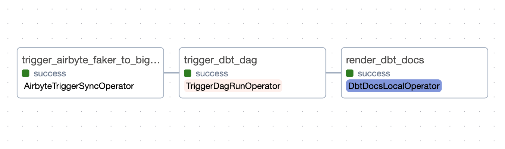
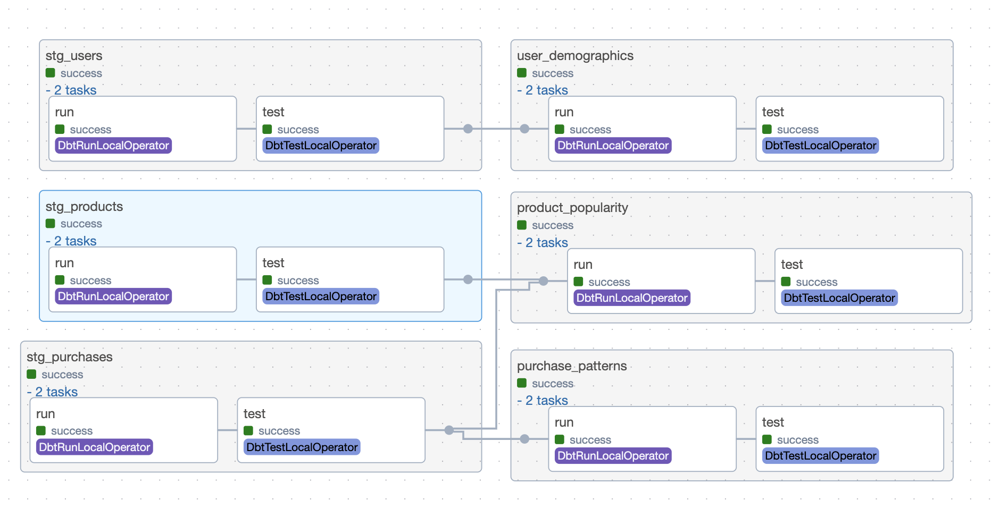

# E-commerce Analytics Stack with Airbyte, dbt, Airflow (ADA) and BigQuery

Welcome to the Airbyte, dbt and Airflow (ADA) Stack with BigQuery quickstart! This repo contains the code to show how to utilize Airbyte and dbt for data extraction and transformation, and implement Apache Airflow to orchestrate the data workflows, providing a end-to-end ELT pipeline. With this setup, you can pull fake e-commerce data, put it into BigQuery, and play around with it using dbt and Airflow.

Here's the diagram of the end to end data pipeline you will build, from the Airflow DAG Graph view:



And here are the transformations happening when the dbt DAG is executed:



## Table of Contents

- [Prerequisites](#prerequisites)
- [Setting an environment for your project](#1-setting-an-environment-for-your-project)
- [Setting Up BigQuery](#2-setting-up-bigquery)
- [Setting Up Airbyte Connectors](#3-setting-up-airbyte-connectors)
- [Setting Up the dbt Project](#4-setting-up-the-dbt-project)
- [Setting Up Airflow](#5-setting-up-airflow)
- [Orchestrating with Airflow](#6-orchestrating-with-airflow)
- [Next Steps](#7-next-steps)

## Prerequisites

Before you embark on this integration, ensure you have the following set up and ready:

1. **Python 3.10 or later**: If not installed, download and install it from [Python's official website](https://www.python.org/downloads/).

2. **Docker and Docker Compose (Docker Desktop)**: Install [Docker](https://docs.docker.com/get-docker/) following the official documentation for your specific OS.

3. **Airbyte OSS version**: Deploy the open-source version of Airbyte locally. Follow the installation instructions from the [Airbyte Documentation](https://docs.airbyte.com/quickstart/deploy-airbyte/).

4. **Terraform (Optional)**: Terraform will help you provision and manage the Airbyte resources. If you haven't installed it, follow the [official Terraform installation guide](https://developer.hashicorp.com/terraform/tutorials/aws-get-started/install-cli). This is an optional step because you can also create and manage Airbyte resources via the UI. Both ways will be described below.

5. **Google Cloud account with BigQuery**: You will also need to add the necessary permissions to allow Airbyte and dbt to access the data in BigQuery. A step-by-step guide is provided [below](#2-setting-up-bigquery).

## 1. Setting an environment for your project

Get the project up and running on your local machine by following these steps:

1. **Clone the repository (Clone only this quickstart)**:  
   ```bash
   git clone --filter=blob:none --sparse  https://github.com/airbytehq/quickstarts.git
   ```

   ```bash
   cd quickstarts
   ```

   ```bash
   git sparse-checkout add airbyte_dbt_airflow_bigquery
   ```

2. **Navigate to the directory**:  
   ```bash
   cd airbyte_dbt_airflow_bigquery
   ```

   At this point you can view the code in your preferred IDE. 
   
   The next steps are only necessary if want to develop or test the dbt models locally, since Airbyte and Airflow are running on Docker.

3. **Set up a virtual environment**:  
   
   You can use the following commands, just make sure to adapt to your specific python installation.

   - For Linux and Mac:
     ```bash
     python3 -m venv venv
     source venv/bin/activate
     ```

   - For Windows:
     ```bash
     python -m venv venv
     .\venv\Scripts\activate
     ```

4. **Install dependencies**: 

   ```bash
   pip install -e ".[dev]"
   ```

## 2. Setting up BigQuery

1. **Create a Google Cloud project**:
   - If you have a Google Cloud project, you can skip this step.
   - Go to the [Google Cloud Console](https://console.cloud.google.com/).
   - Click on the "Select a project" dropdown at the top right and select "New Project".
   - Give your project a name and follow the steps to create it.

2. **Create BigQuery datasets**:
   - In the Google Cloud Console, go to BigQuery.
   - Make two new datasets: `raw_data` for Airbyte and `transformed_data` for dbt.
     - If you pick different names, remember to change the names in the code too.
   
   **How to create a dataset:**
   - In the left sidebar, click on your project name.
   - Click “Create Dataset”.
   - Enter the dataset ID (either `raw_data` or `transformed_data`).
   - Click "Create Dataset".

3. **Create a Service Account and Assign Roles**:
   - Go to “IAM & Admin” > “Service accounts” in the Google Cloud Console.
   - Click “Create Service Account”.
   - Name your service account.
   - Assign the “BigQuery Data Editor” and “BigQuery Job User” roles to the service account.

   **How to create a service account and assign roles:**
   - While creating the service account, under the “Grant this service account access to project” section, click the “Role” dropdown.
   - Choose the “BigQuery Data Editor” and “BigQuery Job User” roles.
   - Finish the creation process.
   
4. **Generate a JSON key for the Service Account**:
   - Make a JSON key to let the service account sign in.
   
   **How to generate a JSON key:**
   - Find the service account in the “Service accounts” list.
   - Click on the service account name.
   - In the “Keys” section, click “Add Key” and pick JSON.
   - The key will download automatically. Keep it safe and don’t share it.

## 3. Setting Up Airbyte Connectors

To set up your Airbyte connectors, you can choose to do it via Terraform, or the UI. Choose one of the two following options.

### 3.1. Setting Up Airbyte Connectors with Terraform

Airbyte allows you to create connectors for sources and destinations via Terraform, facilitating data synchronization between various platforms. Here's how you can set this up:

1. **Navigate to the Airbyte Configuration Directory**:

   ```bash
   cd infra/airbyte
   ```

2. **Modify Configuration Files**:

   Within the `infra/airbyte` directory, you'll find three crucial Terraform files:
    - `provider.tf`: Defines the Airbyte provider.
    - `main.tf`: Contains the main configuration for creating Airbyte resources.
    - `variables.tf`: Holds various variables, including credentials.

   Adjust the configurations in these files to suit your project's needs: 

   - Provide credentials for your BigQuery connection in the `main.tf` file.
      - `dataset_id`: The name of the BigQuery dataset where Airbyte will load data. In this case, enter “raw_data”.
      - `project_id`: Your BigQuery project ID.
      - `credentials_json`: The contents of the service account JSON file. You should input a string, so you need to convert the JSON content to string beforehand.
      - `workspace_id`: Your Airbyte workspace ID, which can be found in the webapp url. For example, in this url: http://localhost:8000/workspaces/910ab70f-0a67-4d25-a983-999e99e1e395/ the workspace id would be `910ab70f-0a67-4d25-a983-999e99e1e395`.

   - Alternatively, you can utilize the `variables.tf` file to manage these credentials:
      - You’ll be prompted to enter the credentials when you execute `terraform plan` and `terraform apply`. If going for this option, just move to the next step. If you don’t want to use variables, remove them from the file.

3. **Initialize Terraform**:
   
   This step prepares Terraform to create the resources defined in your configuration files.
   ```bash
   terraform init
   ```

4. **Review the Plan**:

   Before applying any changes, review the plan to understand what Terraform will do.
   ```bash
   terraform plan
   ```

5. **Apply Configuration**:

   After reviewing and confirming the plan, apply the Terraform configurations to create the necessary Airbyte resources.
   ```bash
   terraform apply
   ```

6. **Verify in Airbyte UI**:

   Once Terraform completes its tasks, navigate to the [Airbyte UI](http://localhost:8000/). Here, you should see your source and destination connectors, as well as the connection between them, set up and ready to go 🎉.

### 3.2. Setting Up Airbyte Connectors Using the UI

Start by launching the Airbyte UI by going to http://localhost:8000/ in your browser. Then:

1. **Create a source**:

   - Go to the Sources tab and click on `+ New source`.
   - Search for “faker” using the search bar and select `Sample Data (Faker)`.
   - Adjust the Count and optional fields as needed for your use case. You can also leave as is. 
   - Click on `Set up source`.

2. **Create a destination**:

   - Go to the Destinations tab and click on `+ New destination`.
   - Search for “bigquery” using the search bar and select `BigQuery`.
   - Enter the connection details as needed.
   - For simplicity, you can use `Standard Inserts` as the loading method.
   - In the `Service Account Key JSON` field, enter the contents of the JSON file. Yes, the full JSON.
   - Click on `Set up destination`.

3. **Create a connection**:

   - Go to the Connections tab and click on `+ New connection`.
   - Select the source and destination you just created.
   - Enter the connection details as needed.
   - Click on `Set up connection`.

That’s it! Your connection is set up and ready to go! 🎉 

## 4. Setting Up the dbt Project

[dbt (data build tool)](https://www.getdbt.com/) allows you to transform your data by writing, documenting, and executing SQL workflows. Setting up the dbt project requires specifying connection details for your data platform, in this case, BigQuery. Here’s a step-by-step guide to help you set this up:

1. **Navigate to the dbt Project Directory**:

   Move to the directory containing the dbt configuration:
   ```bash
   cd ../../dbt_project
   ```

2. **Update Connection Details**:

   - You'll find a `profiles.yml` file within the directory. This file contains configurations for dbt to connect with your data platform. Update this file with your BigQuery connection details. Specifically, you need to update the Service Account JSON file path, the dataset location and your BigQuery project ID.
   - Provide your BigQuery project ID in the `database` field of the `/models/ecommerce/sources/faker_sources.yml` file.

   If you want to avoid hardcoding credentials in the `profiles.yml` file, you can leverage environment variables. Here's an example: `keyfile: "{{ env_var('DBT_BIGQUERY_KEYFILE_PATH', '') }}"`

3. **Test the Connection (Optional)**:
   You can test the connection to your BigQuery instance using the following command. Just take into account that you would need to provide the local path to your service account key file instead.
   
   ```bash
   dbt debug
   ```
   
   If everything is set up correctly, this command should report a successful connection to BigQuery 🎉.

## 5. Setting Up Airflow

Let's set up Airflow for our project, following the steps below. We are basing our setup on the Running Airflow in Docker guide, with some customizations:

1. **Navigate to the Orchestration Directory**:

   ```bash
   cd ../orchestration
   ```

2. **Set Environment Variables**:

   - Open the `.env.example` file located in the `orchestration` directory.
   - Update the necessary fields, paying special attention to the `GCP_SERVICE_ACCOUNT_PATH`, which should point to your local service account JSON key directory path.
   - Rename the file from `.env.example` to `.env` after filling in the details.

3. **Build the custom Airflow image**:

   ```bash
   docker compose build
   ```

4. **Launch the Airflow container**:

   ```bash
   docker compose up
   ```

   This might take a few minutes initially as it sets up necessary databases and metadata.

5. **Setting up Airflow Connections**:

   Both for using Airbyte and dbt, we need to set up connections in Airflow:

   - Access the Airflow UI by navigating to `http://localhost:8080` in your browser. The default username and password are both `airflow`, unless you changed it on the `.env` file.
   - Go to the "Admin" > "Connections" tab.

   **5.1. Create Airbyte Connection**:

      Click on the `+` button to create a new connection and fill in the following details to create an Airbyte connection:

      - **Connection Id**: The name of the connection, this will be used in the DAGs responsible for triggering Airbyte syncs. Name it `airbyte_connection`.
      - **Connection Type**: The type of the connection. In this case, select `Airbyte`.
      - **Host**: The host of the Airbyte instance. Since we're running it locally, use `airbyte-proxy`, which is the name of the container running Airbyte. In case you have a remote instance, you can use the URL of the instance.
      - **Port**: The port of the Airbyte instance. By default the API is exposed on port `8001`.
      - **Login**: If you're using the proxy (it's used by default in the official Airbyte Docker Compose file), this is required. By default it's `airbyte`.
      - **Password**: If you're using the proxy (it's used by default in the official Airbyte Docker Compose file), this is required. By default it's `password`.

      Click on the `Test` button, and make sure you get a `Connection successfully tested` message at the top. Then, you can `Save` the connection.

   **5.2. Create Google Cloud (BigQuery) connection**:

      Click on the `+` button to create a new connection and fill in the following details to create an Google Cloud connection:

      - **Connection Id**: The name of the connection, this one will be used in the DAGs responsible for triggering dbt runs. Name it `dbt_file_connection`.
      - **Connection Type**: The type of the connection. Select `Google Cloud` from the drop down menu.
      - **Project ID**: The Google Cloud project ID. 
      - **Keyfile path**: The path to the service account key file. In this case, it's mounted to `/opt/airflow/service_accounts/[your-service-account-key-file].json`. 
         - Alternatively, you can use the **Keyfile JSON** field and paste the contents of the key file.

      Click on the `Test` button, and make sure you get a `Connection successfully tested` message at the top. Then, you can `Save` the connection.

6. **Integrate dbt with Airflow**:

   We use [Astronomer Cosmos](https://astronomer.github.io/astronomer-cosmos/) to integrate dbt with Airflow. This library parses DAGs and Task Groups from dbt models, and allows us to use Airflow connections instead of dbt profiles. Additionally, it runs tests automatically after each model is completed. To set it up, we've created the file `orchestration/airflow/config/dbt_config.py` with the necessary configurations.

   Update the following in the `dbt_config.py` file, if necessary:

   - The `location` key inside `google_config` with the location of your BigQuery `transformed_data` dataset, if it's not `US`.
   - The method used to create the `google_condig`. The code uses the `GoogleCloudServiceAccountFileProfileMapping` method, assuming that the Google Cloud connection in Airflow was created using the *Keyfile Path*. If you used the *Keyfile JSON*, you should use the `GoogleCloudServiceAccountDictProfileMapping` method instead.

7. **Link Airbyte connection to the Airflow DAG**:

   The last step being being able to execute the DAG in Airflow, is to include the `connection_id` from Airbyte:

   - Visit the Airbyte UI at http://localhost:8000/.
   - In the "Connections" tab, select the "Faker to BigQuery" connection and copy its connection id from the URL.
   - Update the `connection_id` in the `extract_data` task within `orchestration/airflow/dags/elt_dag.py` with this id.

   That's it! Airflow has been configured to work with dbt and Airbyte. 🎉 

## 6. Orchestrating with Airflow
Now that everything is set up, it's time to run your data pipeline!

- In the Airflow UI, go to the "DAGs" section.
- Locate `elt_dag` and click on "Trigger DAG" under the "Actions" column.

This will initiate the complete data pipeline, starting with the Airbyte sync from Faker to BigQuery, followed by dbt transforming the raw data into `staging` and `marts` models. As the last step, it generates dbt docs.

- Confirm the sync status in the Airbyte UI.
- After dbt jobs completion, check the BigQuery console to see the newly created views in the `transformed_data` dataset.
- Once the dbt pipeline completes, you can check the dbt docs from the Airflow UI by going to the "Custom Docs" > "dbt" tab.

Congratulations! You've successfully run an end-to-end workflow with Airflow, dbt and Airbyte. 🎉

## 7. Next Steps

Once you've gone through the steps above, you should have a working Airbyte, dbt and Airflow (ADA) Stack with BigQuery. You can use this as a starting point for your project, and adapt it to your needs. There are lots of things you can do beyond this point, and these tools are evolving fast and adding new features almost every week. Here are some ideas to continue your project:

1. **Expand your data sources**:

   This quickstart uses a very simple data source. Airbyte provides hundreds of sources that might be integrated into your pipeline. And besides configuring and orchestrating them, don't forget to add them as sources in your dbt project. This will make sure you have a lineage graph like the one we showed in the beginning of this document.

2. **Dive into dbt and improve your transformations**:

   dbt is a very powerful tool, and it has lots of features that can help you improve your transformations. You can find more details in the [dbt Documentation](https://docs.getdbt.com/). It's very important that you understand the types of materializations and incremental models, as well as understanding the models, sources, metrics and everything else that dbt provides.

3. **Apply Data Quality into your pipeline**

   dbt provides a simple test framework that is a good starting point, but there is a lot more you can do to ensure your data is correct. You can use Airflow to run manual data quality checks, by using [Sensors](https://airflow.apache.org/docs/apache-airflow/stable/core-concepts/sensors.html) or operators that run custom queries. You can also use specialized tools such as [Great Expectations](https://greatexpectations.io/) to create more complex data quality checks.

4. **Monitoring and alerts**

   Airflow's UI is a good start for simple monitoring, but as your pipelines scale it might be useful to have a more robust monitoring solution. You can use tools such as [Prometheus](https://prometheus.io/) and [Grafana](https://grafana.com/) to create dashboards and alerts for your pipelines, but you can create [notifications using Airflow](https://airflow.apache.org/docs/apache-airflow/2.6.0/howto/notifications.html) or other tools such as [re_data](https://docs.getre.io/latest/docs/re_data/introduction/whatis_data/).

5. **Contribute with the community**

   All tools mentioned here are open-source and have very active communities. You can contribute with them by creating issues, suggesting features, or even creating pull requests. You can also contribute with the Airbyte community by creating [connectors](https://docs.airbyte.io/connector-development) for new sources and destinations.
