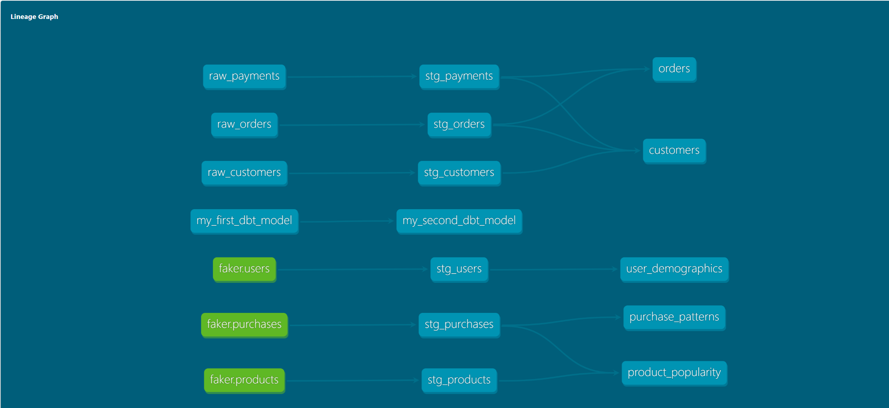
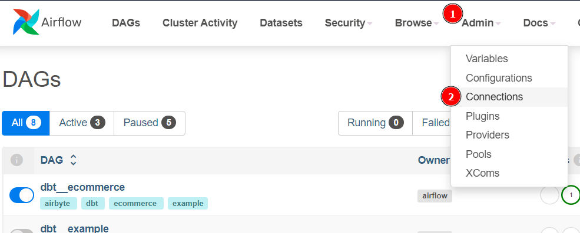
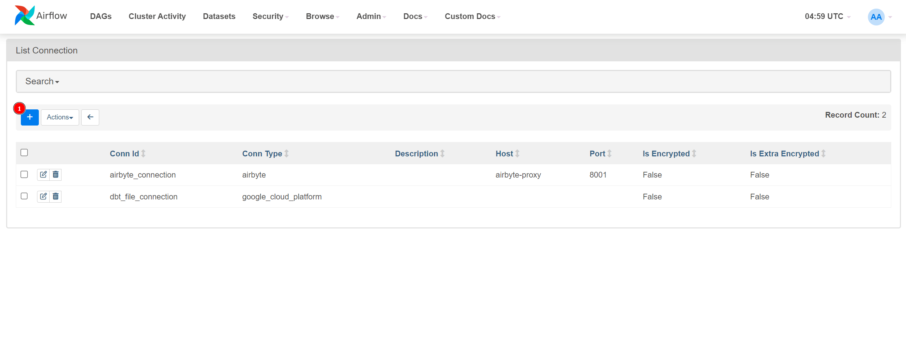
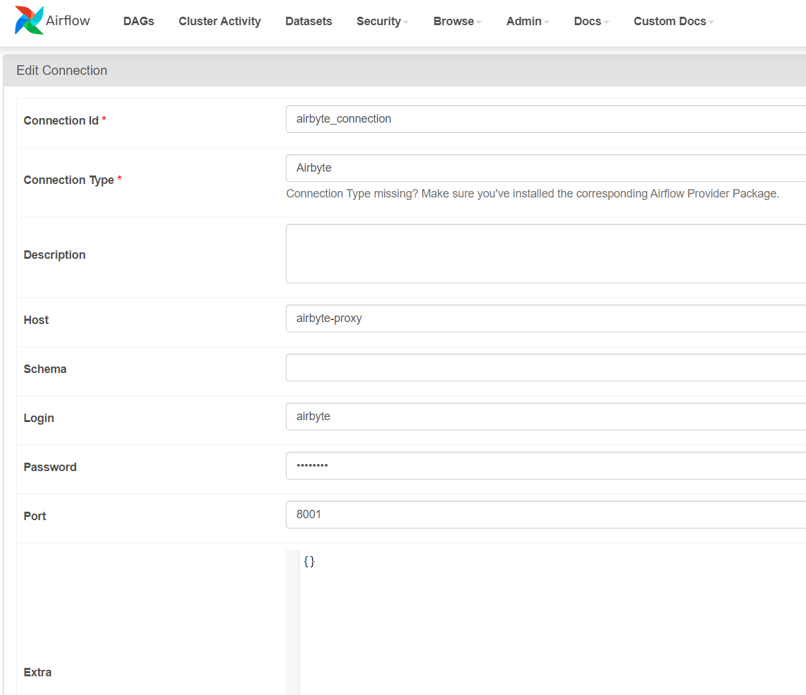
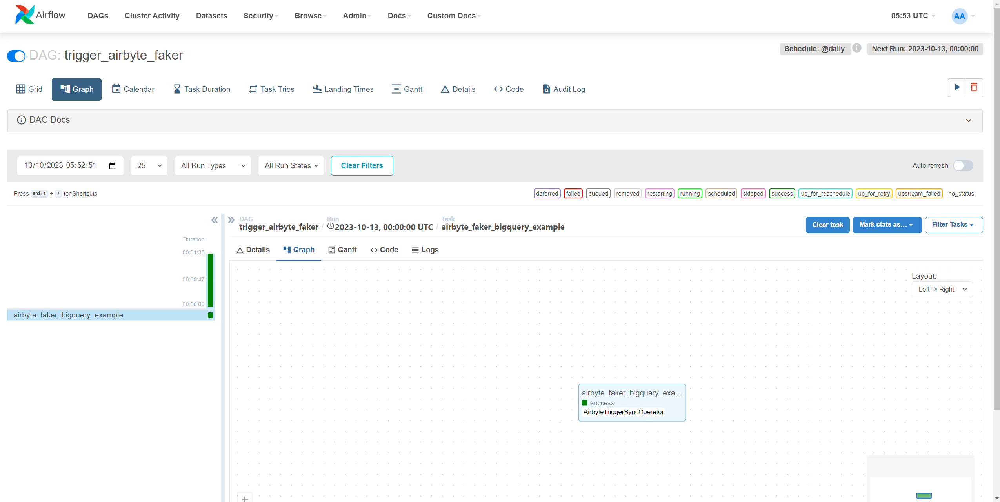
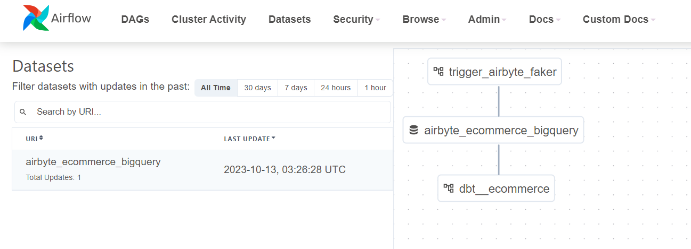
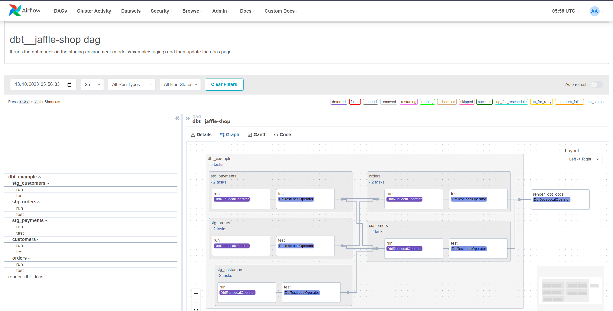
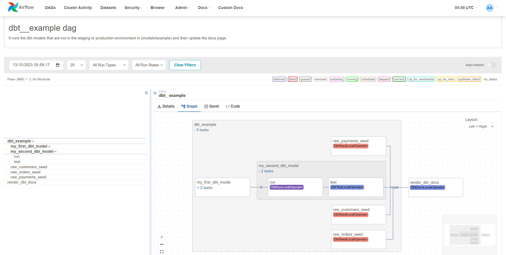
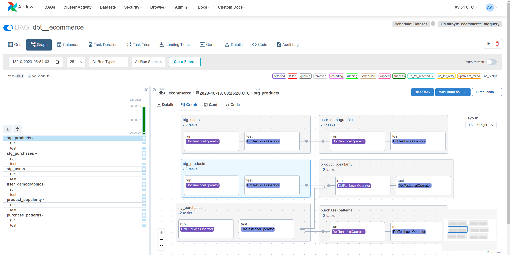
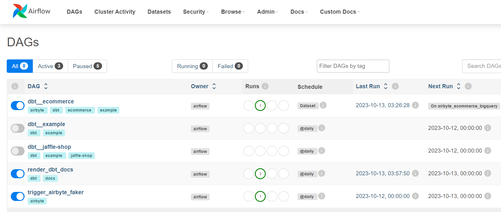

# Airbyte, dbt and Airflow (ADA) Stack with BigQuery

Welcome to the Airbyte, dbt and Airflow (ADA) Stack with BigQuery quickstart! This repo contains the code to show how to utilize Airbyte and dbt for data extraction and transformation, and implement Apache Airflow to orchestrate continuous data synchronization workflows for always-up-to-date data.

This quickstart is designed to help you set up the orchestration of your Airbyte Syncs and dbt models using Apache Airflow, providing a end-to-end ELT pipeline. We have some examples of different forms of running dbt models that can be used as a starting point for your project.

Here's a representation of our data transformations, provided by the dbt Docs page:



In this diagram, the sources in green are provided by our Airbyte Sync.

## Table of Contents

- [Prerequisites](#prerequisites)
- [1. Setting an environment for your project](#1-setting-an-environment-for-your-project)
- [2. Setting up Apache Airflow for development](#2-setting-up-apache-airflow-for-development)
  - [2.1. Running Airflow locally](#21-running-airflow-locally)
- [3. Setting up Airflow Connections](#3-setting-up-airflow-connections)
  - [3.1. Airbyte Connection](#31-airbyte-connection)
  - [3.2. Google Cloud (BigQuery) connection](#32-google-cloud-bigquery-connection)
- [4. Setting up Airbyte Connectors](#4-setting-up-airbyte-connectors)
  - [4.1. With Terraform](#41-with-terraform)
  - [4.2. With the UI](#42-with-the-ui)
- [5. Setting Up the dbt project](#5-setting-up-the-dbt-project)
  - [5.1. Setting up the dbt project on your local machine](#51-setting-up-the-dbt-project-on-your-local-machine)
  - [5.2. Setting up dbt to run in Airflow](#52-setting-up-dbt-to-run-in-airflow)
- [6. Orchestrating with Airflow](#6-orchestrating-with-airflow)
  - [6.1. Triggering Airbyte Syncs](#61-triggering-airbyte-syncs)
  - [6.2. Running dbt models](#62-running-dbt-models)
    - [6.2.1. dbt\_\_jaffle-shop](#621-dbt__jaffle-shop)
    - [6.2.2. dbt\_\_example](#622-dbt__example)
- [7. Next Steps](#7-next-steps)

## Prerequisites

1. **Python 3.10 or later**: If not installed, download and install it from [Python's official website](https://www.python.org/downloads/). We'll also use pip and venv, so make sure they're installed as well.

2. **Docker and Docker Compose**: Install [Docker](https://docs.docker.com/get-docker/) following the official documentation for your specific OS.
   
3. **Apache Airflow with dbt and Airbyte packages**: You can deploy Airflow using Docker Compose. Follow the [official Airflow documentation](https://airflow.apache.org/docs/apache-airflow/stable/start/docker.html) to install it. We've also provided the full configuration file for using it locally in the `orchestration` folder. More details [below]

4. **Airbyte OSS version**: Deploy the open-source version of Airbyte. Follow the installation instructions from the [Airbyte Documentation](https://docs.airbyte.com/quickstart/deploy-airbyte/).

5. **Terraform**: Terraform will help you provision and manage the Airbyte resources. If you haven't installed it, follow the [official Terraform installation guide](https://developer.hashicorp.com/terraform/downloads).

6. **Google Cloud Project with permission to create and give access to a service account**: You will also need to add the necessary permissions to allow Airbyte and dbt to access and write data in BigQuery. A step-by-step guide is provided [below](#2-setting-up-bigquery).

## 1. Setting an environment for your project

Since we're using most of the tools via Docker, this step is not 100% necessary. However, setting this up will help you develop and test your project (and mainly your dbt models) locally.

Get the project up and running on your local machine by following these steps:

1. **Clone the repository (Clone only this quickstart)**:  
   
   ```bash
   git clone --filter=blob:none --sparse  https://github.com/airbytehq/quickstarts.git
   ```

   ```bash
   cd quickstarts
   ```

   ```bash
   git sparse-checkout add ecommerce_analytics_bigquery
   ```
   
2. **Navigate to the directory**:  
   
   ```bash
   cd ecommerce_analytics_bigquery
   ```

3. **Set Up a Virtual Environment**:  
   
   - For Linux or Mac:
     
     ```bash
     python3 -m venv venv
     source venv/bin/activate
     ```

   - For Windows:
     
     ```bash
     python -m venv venv
     .\venv\Scripts\activate
     ```

4. **Install Dependencies**:  
   
   ```bash
   pip install -e ".[dev]"
   ```

## 2. Setting up Apache Airflow for development

We're using the [Running Airflow in Docker](https://airflow.apache.org/docs/apache-airflow/stable/howto/docker-compose/index.html) as a starting point. We've downloaded the official `docker-compose.yaml` file provided by Airflow and adapted it to:
- Use some configurations from an .env file
- Add the Airbyte operator, dbt and astronomer-cosmos packages
- Mount our dbt project folder into the container image
- Connect it with the local deployment of Airbyte

### 2.1. Running Airflow locally

To run this project, you'll need to fill in the `.env` file with the necessary information. You can find an example of the file in the `orchestration` folder. The most important variable is:
- `GCP_SERVICE_ACCOUNT_PATH`: the path to the service account key file. This file will be used to authenticate with BigQuery.

All others can be found in the docker-compose.yaml file and you can change them if you want to.

This configuration will deploy the following containers:
- **Postgres Database**: Airflow's metadata database
- **Airflow Scheduler**: Airflow's scheduler, which will be responsible for parsing and triggering the DAGs
- **Airflow Triggerer**: Airflow's triggerer, which makes possible that tasks can by suspended and reescheduled based on priority
- **Airflow Webserver**: Airflow's webserver, which will be responsible for showing the UI
- **Airflow Worker**: Airflow's worker, which will be responsible for running the tasks
- **Redis Database**: Airflow's broker database, which will be responsible for storing the tasks and their states between the scheduler and the workers

To start it, you need to go to the `orchestration` folder

```bash
cd orchestration
```

Build our Airflow image with the necessary packages

```bash
docker compose build
```

And then run it

```bash
docker compose up
```

This can take a few minutes in the first run, since it will set up the database with all necessary tables and metadata.

When it's done, you can access the Airflow UI at `http://localhost:8080`. The default username and password are both `airflow`, unless you changed it on the `.env` file.

## 3. Setting up Airflow Connections

Both for using Airbyte and dbt, we need to set up some connections in Airflow. You can do that by accessing the Airflow UI and going to the Admin tab. There, you'll find the Connections option. 


Click on it and you'll have the Connections page.



Here you can click on the `+` button to create a new connection.


We'll need to create the following connections:

### 3.1. Airbyte Connection

- **Connection Id**: The name of the connection, this will be used in the DAGs responsible for triggering Airbyte syncs. In this example, we'll use `airbyte_connection`.
- **Connection Type**: The type of the connection. In this case, we'll use `Airbyte`.
- **Host**: The host of the Airbyte instance. Since we're running it locally, we're using `airbyte-proxy`, which is the name of the container running Airbyte. In case you have a remote instance, you can use the URL of the instance.
- **Port**: The port of the Airbyte instance. By default the API is exposed on port `8001`, so we'll use that.
- **Login**: If you're using the proxy (it's used by default in the official Airbyte Docker Compose file), this is required. By default it's `airbyte`.
- **Password**: If you're using the proxy (it's used by default in the official Airbyte Docker Compose file), this is required. By default it's `password`.

In our example, the `Test` button in the form is enabled. You can use it and the result must be `Connection successfully tested`.



### 3.2. Google Cloud (BigQuery) connection

- **Connection Id**: The name of the connection, this one will be used in the DAGs responsible for triggering dbt runs. In this example, we'll use `dbt_file_connection`.
- **Connection Type**: The type of the connection. In this case, we'll use `Google Cloud`.
- **Keyfile path**: The path to the service account key file. In our case, they are mounted into `/opt/airflow/service_accounts/[your-service-account-key-file]`, so we'll use that. Instead of this, you can use the **Keyfile JSON** field and paste the content of the key file.

In our example, the `Test` button in the form is enabled. You can use it and the result must be `Connection successfully tested`.

## 4. Setting up Airbyte Connectors

Airbyte allows you to create connectors for sources and destinations, facilitating data synchronization between various platforms.

### 4.1. With Terraform

You can use Terraform to automate the creation of these connectors and the connections between them. Here's how you can set this up:

1. **Navigate to the Airbyte Configuration Directory**:
   
   Change to the relevant directory containing the Terraform configuration for Airbyte:
   ```bash
   cd infra/airbyte
   ```

2. **Modify Configuration Files**:

   Within the `infra/airbyte` directory, you'll find three crucial Terraform files:
    - `provider.tf`: Defines the Airbyte provider.
    - `main.tf`: Contains the main configuration for creating Airbyte resources.
    - `variables.tf`: Holds various variables, including credentials.

   We've also provided a `terraform.tfvars` file with the necessary variables, so you can provide your own values there.

   Adjust the configurations in these files to suit your project's needs. Specifically, provide credentials for your BigQuery connection. 

   For our example, you'll need to setup the following:
   - `workspace_id`: The ID of the workspace you want to use. You can find it in the URL of the workspace page in the Airbyte UI.
   - `project_id`: The Google Cloud Project ID where we'll use BigQuery.
   - `dataset_id`: The ID of the dataset in BigQuery where data will be stored. You can create it yourself or let Airbyte create it for you.   
   - `credentials_json_path`: The path to the service account key file. This file will be used to authenticate with BigQuery. We're using terraform's file function to read this file, so you don't need to store it within your code.

3. **Initialize Terraform**:
   
   This step prepares Terraform to create the resources defined in your configuration files.
   ```bash
   terraform init
   ```

4. **Review the Plan**:

   Before applying any changes, review the plan to understand what Terraform will do.
   ```bash
   terraform plan
   ```

5. **Apply Configuration**:

   After reviewing and confirming the plan, apply the Terraform configurations to create the necessary Airbyte resources.
   ```bash
   terraform apply
   ```

   It will ask you to confirm if you want to apply the changes. Type `yes` and press enter.

6. **Verify in Airbyte UI**:

   Once Terraform completes its tasks, navigate to the [Airbyte UI](http://localhost:8000/). Here, you should see your source and destination connectors, as well as the connection between them, set up and ready to go.

More details, and the sources and destinations available can be found in the [Airbyte Provider Documentation](https://registry.terraform.io/providers/airbytehq/airbyte/latest/docs).

### 4.2. With the UI

You can also create the connectors manually in the Airbyte UI. The process is very well described in the [Getting Started](https://docs.airbyte.com/category/getting-started) official documentation. Here's a quick step-by-step guide, but in case you need more details, you can follow the documentation.

1. **Navigate to the Airbyte UI**:
   
   Go to the [Airbyte UI](http://localhost:8000/).

2. **Create the Source Connector**: 
   
      1. Click on the `Sources` menu on the left.
      2. Click on the `+ New source` button on the top right. 
      3. Select the type of the source. We're using `Sample Data (Faker)`.
      4. Fill in the form with the necessary information.
      5. Click on the `Set up source` button.
3. **Create the Destination Connector**:
      
      1. Click on the `Destinations` menu on the left.
      2. Click on the `+ New destination` button on the top right. 
      3. Select the type of the destination. We're using `BigQuery`.
      4. Fill in the form with the necessary information. You'll need to set authentication here by providing the `Service Account Key JSON`.
      5. Click on the `Set up destination` button.

4. **Create the Connection**:
      
      1. Click on the `Connections` menu on the left.
      2. Click on the `+ New connection` button on the top right. 
      3. Select the source and destination connectors you want to connect.
      4. Fill in the form with the necessary information. Since we're planning on using Airflow as the orchestrator, we'll set the `Replication frequency` to `Manual`.
      5. Click on the `Set up connection` button.

Either way, you should have the connection set up and ready to go. 

## 5. Setting Up the dbt project

[dbt (data build tool)](https://www.getdbt.com/) allows you to transform your data by writing, documenting, and executing SQL workflows. 

### 5.1. Setting up the dbt project on your local machine

To develop it locally, we need to set up some connection details for your data platform, which in this case, is BigQuery. If you don't want to test your models before deploying them, you don't need this step. Here’s a step-by-step guide to help you set this up:

1. **Navigate to the dbt Project Directory**:

   Change to the directory containing the dbt configuration:
   ```bash
   cd dbt_project
   ```

2. **Update Connection Details**:

   You'll find a `profiles.yml` file within the directory. This file contains configurations for dbt to connect with your data platform. Update this file with your BigQuery connection details.

3. **Utilize Environment Variables (Optional but Recommended)**:

   To keep your credentials secure, you can leverage environment variables. An example is provided within the `profiles.yml` file.

4. **Test the Connection**:

   Once you’ve updated the connection details, you can test the connection to your BigQuery instance using:
   ```bash
   dbt debug
   ```

   If everything is set up correctly, this command should report a successful connection to BigQuery.

5. **Build and test your models**:
   When developing, it might be useful to test your models before running them. To do this, you can run:
   ```bash
   dbt build
   ```

   This will build and test all your resources and make sure your project is set up correctly.

### 5.2. Setting up dbt to run in Airflow

We use [Astronomer Cosmos](https://astronomer.github.io/astronomer-cosmos/) to integrate dbt with Airflow. This library parses DAGs and Task Groups from dbt models, and allows us to use Airflow connections instead of dbt profiles. Additionally, it runs tests automatically after each model is completed.

To set it up, we've created the file `orchestration/airflow/config/dbt_config.py` with the necessary configurations. 

In this file we're setting up the following:

- **project_config**: The path to the dbt project folder. In our case, it's mounted into `/opt/airflow/dbt_project`.
- **google_config**: The configuration that parses an Airflow connection into a dbt profile. Here we need to set the `conn_id` (it's `dbt_file_connection` by default) and the dataset, locations and any other dbt connection configuration. We're using the  `GoogleCloudServiceAccountFileProfileMapping`, which is created by a connection that uses the Keyfile path. If you used the Keyfile JSON, you can use the `GoogleCloudServiceAccountDictProfileMapping` instead.
- **profile_config**: The configuration that uses a profile mapping and exports it to be used by the cosmos operators.

## 6. Orchestrating with Airflow

In the `orchestration/airflow/dags` we have a few examples of DAGs that might be useful. We'll go through some of them and explain how they work.

### 6.1. Triggering Airbyte Syncs

The `dags/airbyte_dag.py` file contains an example of a DAG that triggers an Airbyte sync. It uses the `AirbyteTriggerSyncOperator` to trigger the sync and load our data into BigQuery. More details about this can be found in the [Using the Airbyte Operator to orchestrate Airbyte OSS](https://docs.airbyte.com/operator-guides/using-the-airflow-airbyte-operator).

This operator uses the Connection we created in Airflow to connect to Airbyte on `airbyte_conn_id`, and it needs the `connection_id` to trigger the sync. This ID can be found in the URL path when you open a connection in the Airbyte UI.



We've also set this DAG to output a dataset when the trigger is done, so it can be used to trigger another DAG that uses this data. 




### 6.2. Running dbt models 

Now that our configurations are done in the `config/dbt_config.py` file, we can use it in any of our dags to run our models. We've provided the jaffle_shop example in the `dags/dbt_example.py` file.

In this file we're using the `DbtTaskGroup` operator from cosmos, which will parse the dbt models and create a Task Group that can be used within a DAG. This operator uses the `project_config` and `profile_config` we've set up. 

**By default, every cosmos operator will parse all of your dbt models into the Task Group or DAG. We're using a `RenderConfig` to select specific models to be parsed in our example.**

In the official [documentation from cosmos](https://astronomer.github.io/astronomer-cosmos/configuration/selecting-excluding.html) you can find more details about how to select or exclude models. In our case, we're selecting them by passing the **path** of the models to be run.

We've created two dags:

#### 6.2.1. dbt__jaffle-shop



#### 6.2.2. dbt__example



The dags in this file also have a task with the `DbtDocsOperator`, which will generate/update the dbt docs and provide them in the `plugins/templates/dbt` folder. This is being used to serve the docs in the Airflow UI via a custom plugin. 

Besides these two DAGs with the `DbtTaskGroup` operator, the previous example (`dags/airbyte_dag.py`) also has a DAG parsed by the `DbtDag` operator.



In the end, we have the following DAGs:



## 7. Next Steps

Once you've gone through the steps above, you should have a working Airbyte, dbt and Airflow (ADA) Stack with BigQuery. You can use this as a starting point for your project, and adapt it to your needs. There are lots of things you can do beyond this point, and these tools are evolving fast and adding new features almost every week. Here are some ideas to continue your project:

1. **Expand your data sources**:

   This quickstart uses a very simple data source. Airbyte provides hundreds of sources that might be integrated into your pipeline. And besides configuring and orchestrating them, don't forget to add them as sources in your dbt project. This will make sure you have a lineage graph like the one we showed in the beginning of this document.

2. **Dive into dbt and improve your transformations**:

   dbt is a very powerful tool, and it has lots of features that can help you improve your transformations. You can find more details in the [dbt Documentation](https://docs.getdbt.com/). It's very important that you understand the types of materializations and incremental models, as well as understanding the models, sources, metrics and everything else that dbt provides.

3. **Apply Data Quality into your pipeline**

   dbt provides a simple test framework that is a good starting point, but there is a lot more you can do to ensure your data is correct. You can use Airflow to run manual data quality checks, by using [Sensors](https://airflow.apache.org/docs/apache-airflow/stable/core-concepts/sensors.html) or operators that run custom queries. You can also use specialized tools such as [Great Expectations](https://greatexpectations.io/) to create more complex data quality checks.

4. **Monitoring and alerts**

   Airflow's UI is a good start for simple monitoring, but as your pipelines scale it might be useful to have a more robust monitoring solution. You can use tools such as [Prometheus](https://prometheus.io/) and [Grafana](https://grafana.com/) to create dashboards and alerts for your pipelines, but you can create [notifications using Airflow](https://airflow.apache.org/docs/apache-airflow/2.6.0/howto/notifications.html) or other tools such as [re_data](https://docs.getre.io/latest/docs/re_data/introduction/whatis_data/).

5. **Contribute with the community**

   All tools mentioned here are open-source and have very active communities. You can contribute with them by creating issues, suggesting features, or even creating pull requests. You can also contribute with the Airbyte community by creating [connectors](https://docs.airbyte.io/connector-development) for new sources and destinations.
