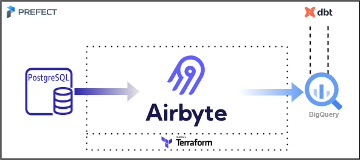
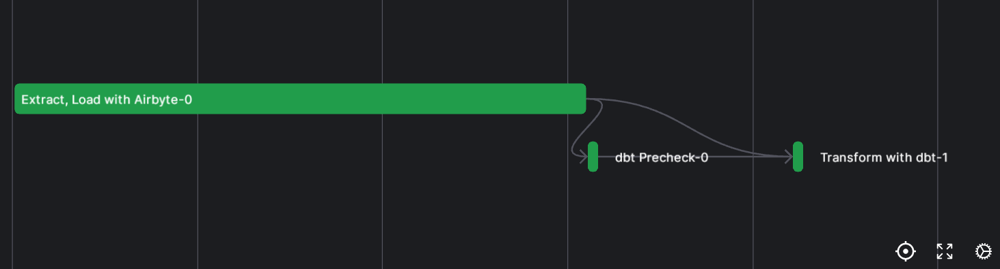

# Airbyte-dbt-Prefect-BigQuery Integration

Welcome to the Prefect, Airbyte, dbt (PAD) Stack with BigQuery quickstart! This repo contains the code to show how to utilize Airbyte and dbt for data extraction and transformation, and utilize Prefect to orchestrate the data workflows, providing a end-to-end ELT pipeline. With this setup, you can pull fake e-commerce data, put it into BigQuery, and play around with it using dbt and Prefect.

## Infrastructure Layout


## Pipeline DAG


## Table of Contents
   - [Prerequisites](#prerequisites)
   - [Setting an environment for your project](#1-setting-an-environment-for-your-project)
   - [Setting Up BigQuery to work with Airbyte and dbt](#2-setting-up-bigquery)
   - [Setting Up Airbyte Connectors](#3-setting-up-airbyte-connectors)
   - [Setting Up the dbt Project](#4-setting-up-the-dbt-project)
   - [Orchestrating with Prefect](#5)
   - [Next Steps](#next-steps)

## Prerequisites

Before you embark on this integration, ensure you have the following set up and ready:

1. **Python 3.10 or later**: If not installed, download and install it from [Python's official website](https://www.python.org/downloads/).

2. **Docker and Docker Compose (Docker Desktop)**: Install [Docker](https://docs.docker.com/get-docker/) following the official documentation for your specific OS.

3. **Airbyte OSS version**: Deploy the open-source version of Airbyte locally. Follow the installation instructions from the [Airbyte Documentation](https://docs.airbyte.com/quickstart/deploy-airbyte/).

4. **Terraform (Optional)**: Terraform will help you provision and manage the Airbyte resources. If you haven't installed it, follow the [official Terraform installation guide](https://developer.hashicorp.com/terraform/tutorials/aws-get-started/install-cli). This is an optional step because you can also create and manage Airbyte resources via the UI. Both ways will be described below.

5. **Google Cloud account with BigQuery**: You will also need to add the necessary permissions to allow Airbyte and dbt to access the data in BigQuery. A step-by-step guide is provided [below](#2-setting-up-bigquery).


## 1. Setting an environment for your project

Get the project up and running on your local machine by following these steps:

1. **Clone the repository (Clone only this quickstart)**:  
   ```bash
   git clone --filter=blob:none --sparse  https://github.com/airbytehq/quickstarts.git
   ```

   ```bash
   cd quickstarts
   ```

   ```bash
   git sparse-checkout add airbyte_dbt_prefect_bigquery
   ```

   
2. **Navigate to the directory**:  
   ```bash
   cd airbyte_dbt_prefect_bigquery
   ```

   At this point you can view the code in your preferred IDE.

3. **Set Up a Virtual Environment**:  
   - For Mac:
     ```bash
     python3 -m venv venv
     source venv/bin/activate
     ```

   - For Windows:
     ```bash
     python -m venv venv
     .\venv\Scripts\activate
     ```

4. **Install Dependencies**:  
   ```bash
   pip install -e ".[dev]"
   ```

## 2. Setting up BigQuery
If you don't have a Google Cloud account, you can sign up and get free credits, which are more than enough to implement this project.

1. **Create a Google Cloud project**:
   - Go to the [Google Cloud Console](https://console.cloud.google.com/).
   - Click on the "Select a project" dropdown at the top right and select "New Project".
   - Give your project a name and follow the steps to create it.

2. **Create BigQuery datasets**:
   - In the Google Cloud Console, go to BigQuery.
   - Make two new datasets: `raw_data` for Airbyte and `transformed_data` for dbt.
     - If you pick different names, remember to change the names in the code too.
   
   **How to create a dataset:**
   - In the left sidebar, click on your project name.
   - Click “Create Dataset”.
   - Enter the dataset ID (either `raw_data` or `transformed_data`).
   - Click "Create Dataset".

3. **Create a Service Account and Assign Roles**:
   - Go to “IAM & Admin” > “Service accounts” in the Google Cloud Console.
   - Click “Create Service Account”.
   - Name your service account.
   - Assign the “BigQuery Data Editor” and “BigQuery Job User” roles to the service account.

   **How to create a service account and assign roles:**
   - While creating the service account, under the “Grant this service account access to project” section, click the “Role” dropdown.
   - Choose the “BigQuery Data Editor” and “BigQuery Job User” roles.
   - Finish the creation process.
   
4. **Generate a JSON key for the Service Account**:
   - Make a JSON key to let the service account sign in.
   
   **How to generate a JSON key:**
   - Find the service account in the “Service accounts” list.
   - Click on the service account name.
   - In the “Keys” section, click “Add Key” and pick JSON.
   - The key will download automatically. Keep it safe and don’t share it.

## 3. Setting Up Airbyte Connectors

To set up your Airbyte connectors, you can choose to do it via Terraform, or the UI. Choose one of the two following options.

### 3.1. Setting Up Airbyte Connectors with Terraform

Airbyte allows you to create connectors for sources and destinations via Terraform, facilitating data synchronization between various platforms. Here's how you can set this up:

1. **Navigate to the Airbyte Configuration Directory**:

   ```bash
   cd infra/airbyte
   ```

2. **Modify Configuration Files**:

   Within the `infra/airbyte` directory, you'll find three crucial Terraform files:
    - `provider.tf`: Defines the Airbyte provider.
    - `main.tf`: Contains the main configuration for creating Airbyte resources.
    - `variables.tf`: Holds various variables, including credentials.

   Adjust the configurations in these files to suit your project's needs: 

   - Provide credentials for your BigQuery connection in the `main.tf` file.
      - `dataset_id`: The name of the BigQuery dataset where Airbyte will load data. In this case, enter “raw_data”.
      - `project_id`: Your BigQuery project ID.
      - `credentials_json`: The contents of the service account JSON file. You should input a string, so you need to convert the JSON content to string beforehand.
      - `workspace_id`: Your Airbyte workspace ID, which can be found in the webapp url. For example, in this url: http://localhost:8000/workspaces/910ab70f-0a67-4d25-a983-999e99e1e395/ the workspace id would be `910ab70f-0a67-4d25-a983-999e99e1e395`.

   - Alternatively, you can utilize the `variables.tf` file to manage these credentials:
      - You’ll be prompted to enter the credentials when you execute `terraform plan` and `terraform apply`. If going for this option, just move to the next step. If you don’t want to use variables, remove them from the file.

3. **Initialize Terraform**:
   
   This step prepares Terraform to create the resources defined in your configuration files.
   ```bash
   terraform init
   ```

4. **Review the Plan**:

   Before applying any changes, review the plan to understand what Terraform will do.
   ```bash
   terraform plan
   ```

5. **Apply Configuration**:

   After reviewing and confirming the plan, apply the Terraform configurations to create the necessary Airbyte resources.
   ```bash
   terraform apply
   ```

6. **Verify in Airbyte UI**:

   Once Terraform completes its tasks, navigate to the [Airbyte UI](http://localhost:8000/). Here, you should see your source and destination connectors, as well as the connection between them, set up and ready to go 🎉.

### 3.2. Setting Up Airbyte Connectors Using the UI

Start by launching the Airbyte UI by going to http://localhost:8000/ in your browser. Then:

1. **Create a source**:

   - Go to the Sources tab and click on `+ New source`.
   - Search for “faker” using the search bar and select `Sample Data (Faker)`.
   - Adjust the Count and optional fields as needed for your use case. You can also leave as is. 
   - Click on `Set up source`.

2. **Create a destination**:

   - Go to the Destinations tab and click on `+ New destination`.
   - Search for “bigquery” using the search bar and select `BigQuery`.
   - Enter the connection details as needed.
   - For simplicity, you can use `Standard Inserts` as the loading method.
   - In the `Service Account Key JSON` field, enter the contents of the JSON file. Yes, the full JSON.
   - Click on `Set up destination`.

3. **Create a connection**:

   - Go to the Connections tab and click on `+ New connection`.
   - Select the source and destination you just created.
   - Enter the connection details as needed.
   - Click on `Set up connection`.

That’s it! Your connection is set up and ready to go! 🎉 

## 4. Setting Up the dbt Project

[dbt (data build tool)](https://www.getdbt.com/) allows you to transform your data by writing, documenting, and executing SQL workflows. Setting up the dbt project requires specifying connection details for your data platform, in this case, BigQuery. Here’s a step-by-step guide to help you set this up:

1. **Navigate to the dbt Project Directory**:

   Move to the directory containing the dbt configuration:
   ```bash
   cd ../../dbt_project
   ```

2. **Update Connection Details**:

   - You'll find a `profiles.yml` file within the directory. This file contains configurations for dbt to connect with your data platform. Update this file with your BigQuery connection details. Specifically, you need to update the Service Account JSON file path, the dataset location and your BigQuery project ID.
   - Provide your BigQuery project ID in the `database` field of the `/models/ecommerce/sources/faker_sources.yml` file.

   If you want to avoid hardcoding credentials in the `profiles.yml` file, you can leverage environment variables. Here's an example: `keyfile: "{{ env_var('DBT_BIGQUERY_KEYFILE_PATH', '') }}"`

3. **Test the Connection (Optional)**:
   You can test the connection to your BigQuery instance using the following command. Just take into account that you would need to provide the local path to your service account key file instead.
   
   ```bash
   dbt debug
   ```
   
   If everything is set up correctly, this command should report a successful connection to BigQuery 🎉.

## 5. Orchestrating with Prefect

[Prefect](https://prefect.io/) is an orchestration workflow tool that makes it easy to build, run, and monitor data workflows by writing Python code. In this section, we'll walk you through creating a Prefect flow to orchestrate both Airbyte extract and load operations, and dbt transformations with Python:

1. **Navigate to the Orchestration Directory**:

   Switch to the directory containing the Prefect orchestration configurations:
   ```bash
   cd ../orchestration
   ```

2. **Update the Airbyte Connection ID**:

   Open the `my_elt_flow.py` Python script and update the `connection_id` key in the `airbyte_connection` object.

   To find your connection id go to the [Airbyte UI](http://localhost:8000/), then select the connection you want to use from the "Connections" tab and copy the ID from the URL (you'll find it after `/connections/`, i.e., `e3646db8-6612-4142-8edf-1e51932b6836`).

3. **Set Environment Variables**:

   Prefect requires certain environment variables to be set to interact with other tools, like Airbyte. Set the following variables:

   ```bash
   export AIRBYTE_PASSWORD=password
   ```

   Additionally, set the following environment variable to avoid unnecessary notifications from Prefect:

   ```bash
   export PREFECT_API_SERVICES_FLOW_RUN_NOTIFICATIONS_ENABLED=false
   ```
   
4. **Connect to Prefect's API**:

   Open a new terminal window. Start a local Prefect server instance in your virtual environment:

   ```bash
   prefect server start
   ```

5. **Deploy the Flow**:

   Go back to your previous terminal and execute the following python script:

   ```bash
   python my_elt_flow.py
   ```

   When you run the flow script, Prefect will automatically create a flow deployment that you can interact with via the UI and API. The script will stay running so that it can listen for scheduled or triggered runs of this flow; once a run is found, it will be executed within a subprocess.

6. **Access Prefect UI in Your Browser**:

   Open your browser and navigate to:
   ```
   http://127.0.0.1:4200
   ```
   You can now begin interacting with your newly created deployment! 🎉

## Next Steps

Congratulations on deploying and running this quickstart! 🎉 Here are some suggestions on what you can explore next to dive deeper and get more out of your project:

### 1. **Explore the Data and Insights**
   - Dive into the datasets in BigQuery, run some queries, and explore the data you've collected and transformed. This is your chance to uncover insights and understand the data better!

### 2. **Optimize Your dbt Models**
   - Review the transformations you’ve applied using dbt. Try optimizing the models or create new ones based on your evolving needs and insights you want to extract.

### 3. **Expand Your Data Sources**
   - Add more data sources to Airbyte. Explore different types of sources available, and see how they can enrich your existing datasets and broaden your analytical capabilities.

### 4. **Enhance Data Quality and Testing**
   - Implement data quality tests in dbt to ensure the reliability and accuracy of your transformations. Use dbt's testing features to validate your data and catch issues early on.

### 5. **Scale Your Setup**
   - Consider scaling your setup to handle more data, more sources, and more transformations. Optimize your configurations and resources to ensure smooth and efficient processing of larger datasets.

### 7. **Contribute to the Community**
   - Share your learnings, optimizations, and new configurations with the community. Contribute to the respective tool’s communities and help others learn and grow.