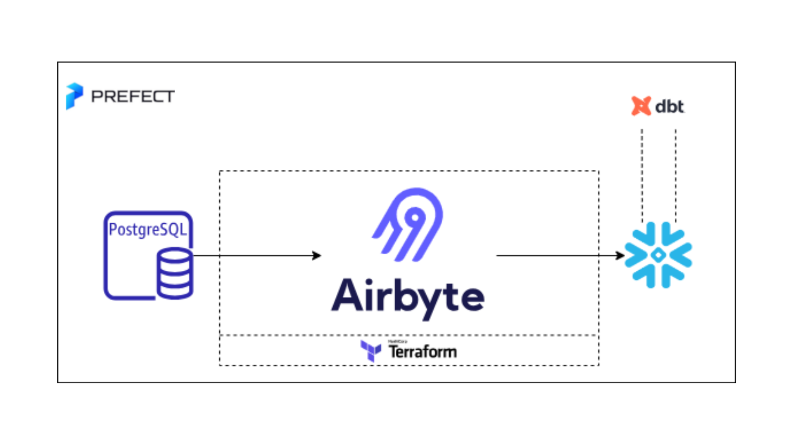

# Airbyte-dbt-Prefect-Snowflake Integration

Welcome to the "Airbyte-dbt-Prefect-Snowflake Integration" repository! This repo provides a quickstart template for building a full data stack using Airbyte, Prefect, dbt, and Snowflake. Easily extract data from Postgres and load it into Snowflake using Airbyte, and apply necessary transformations using dbt, all orchestrated seamlessly with Prefect. While this template doesn't delve into specific data or transformations, its goal is to showcase the synergy of these tools.

This quickstart is designed to minimize setup hassles and propel you forward.

## Table of Contents

- [Airbyte-dbt-Prefect-Snowflake Integration](#airbyte-dbt-prefect-snowflake-integration)
  - [Table of Contents](#table-of-contents)
  - [Infrastructure Layout](#infrastructure-layout)
  - [Prerequisites](#prerequisites)
  - [1. Setting an environment for your project](#1-setting-an-environment-for-your-project)
  - [2. Setting Up Airbyte Connectors with Terraform](#2-setting-up-airbyte-connectors-with-terraform)
  - [3. Setting Up the dbt Project](#3-setting-up-the-dbt-project)
  - [4. Orchestrating with Prefect](#4-orchestrating-with-Prefect)
  - [Next Steps](#next-steps)

## Infrastructure Layout


## Prerequisites

Before you embark on this integration, ensure you have the following set up and ready:

1. **Python 3.10 or later**: If not installed, download and install it from [Python's official website](https://www.python.org/downloads/).

2. **Docker and Docker Compose (Docker Desktop)**: Install [Docker](https://docs.docker.com/get-docker/) following the official documentation for your specific OS.

3. **Airbyte OSS version**: Deploy the open-source version of Airbyte. Follow the installation instructions from the [Airbyte Documentation](https://docs.airbyte.com/quickstart/deploy-airbyte/).

4. **Terraform**: Terraform will help you provision and manage the Airbyte resources. If you haven't installed it, follow the [official Terraform installation guide](https://developer.hashicorp.com/terraform/tutorials/aws-get-started/install-cli).


## 1. Setting an environment for your project

Get the project up and running on your local machine by following these steps:

1. **Clone the repository (Clone only this quickstart)**:  
   ```bash
   git clone --filter=blob:none --sparse  https://github.com/airbytehq/quickstarts.git
   ```

   ```bash
   cd quickstarts
   ```

   ```bash
   git sparse-checkout add airbyte_dbt_Prefect_snowflake
   ```

   
2. **Navigate to the directory**:  
   ```bash
   cd airbyte_dbt_prefect_snowflake
   ```

3. **Set Up a Virtual Environment**:  
   - For Mac:
     ```bash
     python3 -m venv venv
     source venv/bin/activate
     ```
   - For Windows:
     ```bash
     python -m venv venv
     .\venv\Scripts\activate
     ```

4. **Install Dependencies**:  
   ```bash
   pip install -e ".[dev]"
   ```

## 2. Setting Up Airbyte Connectors with Terraform

Airbyte allows you to create connectors for sources and destinations, facilitating data synchronization between various platforms. In this project, we're harnessing the power of Terraform to automate the creation of these connectors and the connections between them. Here's how you can set this up:

1. **Navigate to the Airbyte Configuration Directory**:
   
   Change to the relevant directory containing the Terraform configuration for Airbyte:
   ```bash
   cd infra/airbyte
   ```

2. **Modify Configuration Files**:

   Within the `infra/airbyte` directory, you'll find three crucial Terraform files:
    - `provider.tf`: Defines the Airbyte provider.
    - `main.tf`: Contains the main configuration for creating Airbyte resources.
    - `variables.tf`: Holds various variables, including credentials.

   Adjust the configurations in these files to suit your project's needs. Specifically, provide credentials for your Postgres and Snowflake connections. You can utilize the `variables.tf` file to manage these credentials.

3. **Initialize Terraform**:
   
   This step prepares Terraform to create the resources defined in your configuration files.
   ```bash
   terraform init
   ```

4. **Review the Plan**:

   Before applying any changes, review the plan to understand what Terraform will do.
   ```bash
   terraform plan
   ```

5. **Apply Configuration**:

   After reviewing and confirming the plan, apply the Terraform configurations to create the necessary Airbyte resources.
   ```bash
   terraform apply
   ```

6. **Verify in Airbyte UI**:

   Once Terraform completes its tasks, navigate to the Airbyte UI. Here, you should see your source and destination connectors, as well as the connection between them, set up and ready to go.

## 3. Setting Up the dbt Project

[dbt (data build tool)](https://www.getdbt.com/) allows you to transform your data by writing, documenting, and executing SQL workflows. Setting up the dbt project requires specifying connection details for your data platform, in this case, Snowflake. Here’s a step-by-step guide to help you set this up:

1. **Navigate to the dbt Project Directory**:

   Change to the directory containing the dbt configuration:
   ```bash
   cd ../../dbt_project
   ```

2. **Update Connection Details**:

   You'll find a `profiles.yml` file within the directory. This file contains configurations for dbt to connect with your data platform. Update this file with your Snowflake connection details.

3. **Utilize Environment Variables (Optional but Recommended)**:

   To keep your credentials secure, you can leverage environment variables. An example is provided within the `profiles.yml` file.

4. **Test the Connection**:

   Once you’ve updated the connection details, you can test the connection to your Snowflake instance using:
   ```bash
   dbt debug
   ```

   If everything is set up correctly, this command should report a successful connection to Snowflake.

## 4. Orchestrating with Prefect

[Prefect](https://prefect.io/) is an orchestration workflow tool that makes it easy to build, run, and monitor data workflows by writing Python code. In this section, we'll walk you through creating a Prefect flow to orchestrate both Airbyte extract and load operations, and dbt transformations with Python:

1. **Navigate to the Orchestration Directory**:

   Switch to the directory containing the Prefect orchestration configurations:
   ```bash
   cd ../orchestration
   ```

2. **Set Environment Variables**:

   Prefect requires certain environment variables to be set to interact with other tools like dbt and Airbyte. Set the following variables:

   ```bash
   export AIRBYTE_PASSWORD=password
   ```

3. **Connect to Prefect's API**:

   Open a new terminal window. Start a local Prefect server instance in your virtual environment:

   ```bash
   prefect server start
   ```

4. **Deploy the Flow**:

   When we run the flow script, Prefect will automatically create a flow deployment that you can interact with via the UI and API. The script will stay running so that it can listen for scheduled or triggered runs of this flow; once a run is found, it will be executed within a subprocess.

   ```bash
   python my_elt_flow.py
   ```

5. **Access Prefect UI in Your Browser**:

   Open your browser and navigate to:
   ```
   http://127.0.0.1:4200
   ```
   You can now begin interacting with your newly created deployment!

## Next Steps

Once you've set up and launched this initial integration, the real power lies in its adaptability and extensibility. Here’s a roadmap to help you customize and harness this project tailored to your specific data needs:

1. **Create dbt Sources for Airbyte Data**:

   - Your raw data extracted via Airbyte can be represented as sources in dbt. Start by [creating new dbt sources](https://docs.getdbt.com/docs/build/sources) to represent this data, allowing for structured transformations down the line.

2. **Add Your dbt Transformations**:

   - With your dbt sources in place, you can now build upon them. Add your custom SQL transformations in dbt, ensuring that you treat the sources as an upstream dependency. This ensures that your transformations work on the most up-to-date raw data.

### 3. **Extend the Prefect Pipeline**:

   - You can create flow runs from this deployment via API calls to be triggered by new data sync in Airbyte rather than on a schedule. You can customize your dbt   runs based on the results got from AirbyteSyncResult. You can also migrate the deployment to the Prefect cloud.

4. **Extend the Project**:

   - The real beauty of this integration is its extensibility. Whether you want to add more data sources, integrate additional tools, or enhance your transformation logic – the floor is yours. With the foundation set, sky's the limit for how you want to extend and refine your data processes.

