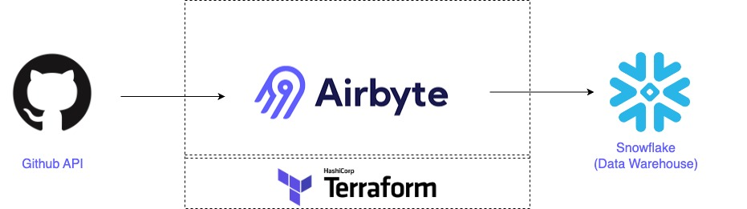

# API to Warehouse Stack


Welcome to the "API to Warehouse Stack" repository! This repository offers a simple template to help you get data from various APIs and put it into your data warehouse for further analysis using Airbyte. You can use several supported APIs as your data sources for this process. Here are a few examples of the APIs you can set up to extract data using Airbyte.

- [Twitter API](https://docs.airbyte.com/integrations/sources/twitter)
- [US census API](https://docs.airbyte.com/integrations/sources/us-census)
- [Rocket.chat API](https://docs.airbyte.com/integrations/sources/rocket-chat)
- [Recreation.gov API](https://docs.airbyte.com/integrations/sources/recreation)
- [Polygon Stock API](https://docs.airbyte.com/integrations/sources/polygon-stock-api)
- [PokeAPI](https://docs.airbyte.com/integrations/sources/pokeapi)
- Many more

Here are some data warehouses that users can choose as a destination to load the data extracted from APIs.

- [Snowflake](https://docs.airbyte.com/integrations/destinations/snowflake)
- [BigQuery](https://docs.airbyte.com/integrations/destinations/bigquery)
- [Amazon Redshift](https://docs.airbyte.com/integrations/destinations/redshift)
- Many more

In this process, we'll use the Github API to get data and Snowflake as the data warehouse to store the data.

## Table of Contents

- [API to Warehouse Stack](#api-to-warehouse-stack)
  - [Table of Contents](#table-of-contents)
  - [Infrastructure Layout](#infrastructure-layout)
  - [Setting an environment for your project](#setting-an-environment-for-your-project)
  - There are two ways to setup the connectors of airbyte.
    - [1. Using Airbyte UI](#1-using-airbyte-ui)
    - [2. Using Terraform to Setup the Connector](#2-using-terraform-to-setup-the-connector)
  - [Next Steps](#next-steps)


## Infrastructure Layout



## Prerequisites

Before you embark on this integration, ensure you have the following set up and ready:

1. **Python 3.10 or later**: If not installed, download and install it from [Python's official website](https://www.python.org/downloads/).

2. **Docker and Docker Compose (Docker Desktop)**: Install [Docker](https://docs.docker.com/get-docker/) following the official documentation for your specific OS.

3. **Airbyte OSS version**: Deploy the open-source version of Airbyte. Follow the installation instructions from the [Airbyte Documentation](https://docs.airbyte.com/quickstart/deploy-airbyte/).

4. **Terraform**: Terraform will help you provision and manage the Airbyte resources. If you haven't installed it, follow the [official Terraform installation guide](https://developer.hashicorp.com/terraform/tutorials/aws-get-started/install-cli).

## Setting an environment for your project

Get the project up and running on your local machine by following these steps:

1. **Clone the repository (Clone only this quickstart)**:  
   ```bash
   git clone --filter=blob:none --sparse  https://github.com/airbytehq/quickstarts.git
   ```

   ```bash
   cd quickstarts
   ```

   ```bash
   git sparse-checkout add api_to_warehouse
   ```

   
2. **Navigate to the directory**:  
   ```bash
   cd api_to_warehouse
   ```

3. **Set Up a Virtual Environment**:  
   - For Mac:
     ```bash
     python3 -m venv venv
     source venv/bin/activate
     ```
   - For Windows:
     ```bash
     python -m venv venv
     .\venv\Scripts\activate
     ```

4. **Install Dependencies**:  
   ```bash
   pip install -e ".[dev]"
   ```


## 1. Using Airbyte UI

To establish the connection and import data from the Github API into the Snowflake warehouse, kindly proceed by utilizing the Airbyte user interface. The following steps should be adhered to:

1. Run the Airbyte OSS version by following the [documentation](https://docs.airbyte.com/quickstart/deploy-airbyte).

2. Setup the Github API as source by following [these steps](https://docs.airbyte.com/integrations/sources/github).

3. Setup the Snowflake as destination by following [these steps](https://docs.airbyte.com/integrations/destinations/snowflake)

4. Please proceed to configure the synchronization time and select the specific tables you wish to load into Snowflake from GitHub. You can make your selection from the list of available streams.

5. Enjoy :smile:, your data loaded into Snowflake data warehouse from Github API.


## 2. Using Terraform to Setup the Connector

Airbyte enables you to make connections between different platforms by creating connectors for sources and destinations. In this project, we're using Terraform to automate the setup of these connectors and their connections. Here's how you can do it:

1. **Navigate to the Airbyte Configuration Directory**:
   
   Change to the relevant directory containing the Terraform configuration for Airbyte:
   ```bash
   cd infra/airbyte
   ```

2. **Modify Configuration Files**:

   Within the `infra/airbyte` directory, you'll find three crucial Terraform files:
    - `provider.tf`: Defines the Airbyte provider.
    - `main.tf`: Contains the main configuration for creating Airbyte resources.
    - `variables.tf`: Holds various variables, including credentials.

   Adjust the configurations in these files to suit your project's needs. Specifically, provide credentials for your Postgres connections. You can utilize the `variables.tf` file to manage these credentials.

3. **Initialize Terraform**:
   
   This step prepares Terraform to create the resources defined in your configuration files.
   ```bash
   terraform init
   ```

4. **Review the Plan**:

   Before applying any changes, review the plan to understand what Terraform will do.
   ```bash
   terraform plan
   ```

5. **Apply Configuration**:

   After reviewing and confirming the plan, apply the Terraform configurations to create the necessary Airbyte resources.
   ```bash
   terraform apply
   ```

6. **Verify in Airbyte UI**:

   After Terraform finishes its tasks, go to the Airbyte user interface. You will find your source and destination connectors already set up, along with the connection between them, all ready to use.

## Next Steps

After you extract and load data from an API into a data warehouse, you can analyze the data. For example, we used Snowflake data warehouse, which supports analytical tools like [Tableau](https://www.snowflake.com/resource/best-practices-for-using-tableau-with-snowflake/?utm_cta=website-be-trending-snowflake-tableau-ek), [Talend](https://www.snowflake.com/technology-partners/talend/) and [Sigma](https://www.snowflake.com/technology-partners/sigma/). 