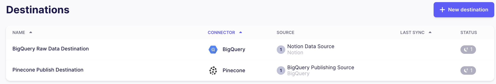

# Data-to-Pinecone Integration

Welcome to the "Data-to-Pinecone Integration" repository! This repo provides a quickstart template for building a full data stack using Airbyte, Terraform, and dbt to move data from Notion -> BigQuery -> Pinecone for interacting with Notion data through an LLM.

This quickstart is designed to minimize setup hassles and propel you forward.


## Table of Contents

- [Prerequisites](#prerequisites)
- [Creating an Environment For Your Project](#1-creating-an-environment-for-your-project)
- [Adding Configuration Values](#2-adding-configuration-values)
- [Setting Up Airbyte Connectors](#3-setting-up-airbyte-connectors)
- [Sync Notion Data into BigQuery](#4-sync-notion-data-into-bigquery)
- [Setting Up the dbt Project](#5-setting-up-the-dbt-project)
- [Publishing Into Pinecone](#6-publishing-into-pinecone)
- [Asking Questions About Your Data](#7-asking-questions-about-your-data)
- [Next Steps](#8-next-steps)

## Prerequisites

### Notion

We'll source Notion pages to make the content searchable in Pinecone. Follow the [Notion source docs](https://docs.airbyte.com/integrations/sources/notion) for information on configuring a Notion source.

### BigQuery

BigQuery will store the raw API data from our sources and also the transformed data from dbt. You'll need a BigQuery project and a dataset with a service account that can control the dataset. Airbyte's [BigQuery destination docs](https://docs.airbyte.com/integrations/destinations/bigquery) lists the requirements and links describing how to configure.

### Pinecone

Pinecone is the vector database we will use to index documents and their metadata, and also for finding documents that provide context for a query. You'll need a Pinecone account, an API key, and an index created with 1536 dimensions, as OpenAI returns vectors of 1536 dimensions. See the [Pinecone docs](https://docs.pinecone.io/docs/quickstart) for more information.

### OpenAI

OpenAI is used both in processing the query and also provides the LLM for generating a response. The query is vectorized so it can be used to identify relevant items in the Pinecone index, and these items are provided to the LLM as context to better respond to the query. You'll need an OpenAI account with credits and an API key. If you already have an account with OpenAI, you can generate a new API key by visiting this link: [platform.openai.com/api-keys](https://platform.openai.com/api-keys)

### Software

1. **Python 3.10 or later**: If not installed, download and install it from [Python's official website](https://www.python.org/downloads/).

2. **Docker and Docker Compose (Docker Desktop)**: Install [Docker](https://docs.docker.com/get-docker/) following the official documentation for your specific OS.

3. **Airbyte OSS version**: If you want to deploy the open-source version instead of using Airbyte Cloud, follow the installation instructions from the [Deploy Airbyte documentation](https://docs.airbyte.com/quickstart/deploy-airbyte/).

4. **Terraform**: Terraform will help you provision and manage the Airbyte resources. If you haven't installed it, follow the [official Terraform installation guide](https://developer.hashicorp.com/terraform/tutorials/aws-get-started/install-cli).

## 1. Creating an Environment For Your Project

Get the project up and running on your local machine by following these steps:

1. **Clone the repository (Clone only this quickstart)**:

   ```bash
   git clone --filter=blob:none --sparse  https://github.com/airbytehq/quickstarts.git
   ```

   ```bash
   cd quickstarts
   ```

   ```bash
   git sparse-checkout add data_to_pinecone_llm
   ```

2. **Navigate to the directory**:

   ```bash
   cd data_to_pinecone_llm
   ```

3. **Set Up a Virtual Environment**:

   - For Mac:
     ```bash
     python3 -m venv .venv
     source .venv/bin/activate
     ```
   - For Windows:
     ```bash
     python -m venv .venv
     .\.venv\Scripts\activate
     ```

4. **Install Dependencies**:
   ```bash
   pip install -e ".[dev]"
   ```

## 2. Adding Configuration Values

The following steps will execute Terraform and dbt workflows to create the necessary resources for the integration. To do this, you'll need to provide some configuration values. Copy the provided `.env.template` file to `.env` and set its values. Then run the following command to source the environment variables into your shell so they are available when running Terraform and dbt:

```bash
set -o allexport && source .env && set +o allexport
```

Don't forget to re-run the above command after making any changes to the `.env` file.

## 3. Setting Up Airbyte Connectors

### Manually via the Airbyte UI

Create the [sources](https://docs.airbyte.com/quickstart/add-a-source) and [destinations](https://docs.airbyte.com/quickstart/add-a-destination) within your Airbyte environment, you can follow the [create connections](https://docs.airbyte.com/quickstart/create-a-connection) to define connections between them to control how and when the data will sync.

You can find the Airbyte workspace ID from the URL, e.g. `https://cloud.airbyte.com/workspaces/{workspace-id}/connections`.

### With Terraform

Airbyte allows you to create connectors for sources and destinations, facilitating data synchronization between various platforms. In this project, we're harnessing the power of Terraform to automate the creation of these connectors and the connections between them. Here's how you can set it up:

1. **Navigate to the Airbyte Configuration Directory**:

   Change to the relevant directory containing the Terraform configuration for Airbyte:

   ```bash
   cd infra/airbyte
   ```

2. **Modify Configuration Files**:

   Within the `infra/airbyte` directory, you'll find three crucial Terraform files:

   - `provider.tf`: Defines the Airbyte provider.
   - `main.tf`: Contains the main configuration for creating Airbyte resources.
   - `variables.tf`: Defines variables whose values are populated from the `.env` file.

   If you're using Airbyte Cloud instead of a local deployment you will need to update the Airbyte provider configuration in _infra/airbyte/provider.tf_, setting the `bearer_auth` to an API key generated at https://portal.airbyte.com/.

3. **Initialize Terraform**:

   This step prepares Terraform to create the resources defined in your configuration files.

   ```bash
   terraform init
   ```

4. **Review the Plan**:

   Before applying any changes, review the plan to understand what Terraform will do.

   ```bash
   terraform plan
   ```

5. **Apply Configuration**:

   After reviewing and confirming the plan, apply the Terraform configurations to create the necessary Airbyte resources.

   ```bash
   terraform apply
   ```

6. **Verify in Airbyte UI**:

   Once Terraform completes its tasks, navigate to the Airbyte UI. Here, you should see your source and destination connectors, as well as the connection between them, set up and ready to go.

   If you're using Airbyte Cloud, we configured Terraform to assemble the URL for you:

   ```bash
   terraform output
   ```

   will print something like:

   ```
   airbyte_cloud_url = "https://cloud.airbyte.com/workspaces/{workspace-id}/connections"
   ```





## 4. Sync Notion Data into BigQuery

Before building the dbt project, transforming the raw notion data, the source tables must exist in the BigQuery dataset. Open the Airbyte UI and navigate to the Connections page. Click the _Sync Now_ button for `Notion to BigQuery` to start the sync.


Once the sync is complete you can inspect the tables in BigQuery.


## 5. Setting Up the dbt Project

[dbt (data build tool)](https://www.getdbt.com/) allows you to transform your data by writing, documenting, and executing SQL workflows. Setting up the dbt project requires specifying connection details for your data platform, in this case, BigQuery. Here’s a step-by-step guide to help you set this up:

1. **Navigate to the dbt Project Directory**:

   Change to the directory containing the dbt configuration:

   ```bash
   cd dbt_project
   ```

   You'll find a `profiles.yml` file within the directory. This file contains configurations for dbt to connect with your data platform, and is preconfigured to pull the connection details from environment variables.

2. **Utilize Environment Variables (Optional but Recommended)**:

   To keep your credentials secure, you can leverage environment variables. An example is provided as the `keyfile` config in `profiles.yml`.

3. **Test the Connection**:

   Once you’ve updated the connection details, you can test the connection to your BigQuery instance using:

   ```bash
   dbt debug
   ```

   If everything is set up correctly, this command should report a successful connection to BigQuery.

4. **Run the Model**

   With the connection in place, you can now build the model to create the `notion` view in BigQuery, which the configured Airbyte connection will use to sync Notion pages into Pinecone.

   You can inspect the provided _dbt_project/models/notion.sql_ to see how it collates Notion blocks into a single text field which can be vectorized and indexed into Pinecone.

   ```bash
   dbt build
   ```

   You should now see the `notion_data` view in BigQuery.

   

## 6. Publishing Into Pinecone

With the source data transformed it is now ready to publish into the Pinecone index. Head back to the Connections and start a sync for `Publish BigQuery Data to Pinecone`.


## 7. Asking Questions About Your Data

After Airbyte has published the Notion page text into your Pinecone index, it is ready to be interacted with via an LLM model. After providing a couple more environment variables, the provided _query.py_ will provide an interactive session to ask questions about your data.

```bash
export OPENAI_API_KEY=openai_api_key
export PINECONE_API_KEY=pinecone_api_key
export PINECONE_ENVIRONMENT=pinecone_environment
export PINECONE_INDEX=pinecone_index

python query.py
```

## 8. Next Steps

Once you've set up and launched this initial integration, the real power lies in its adaptability and extensibility. Here’s a roadmap to help you customize and harness this project tailored to your specific data needs:

1. **Use Additional Data Sources**:

   Pinecone allows you to store vectors from multiple sources in a single index. This allows multiple document types to be queried together, and even referenced between themselves by the LLM. Add additional sources to the Terraform configuration or manually through the Airbyte UI.

2. **Try Different LLM Chains**:

   The provided _query.py_ uses many default values when creating the LLM chain, which is quick to create but limits flexibility. One constraint is that the `stuff` chain type requires the query and discovered documents all fit within a single tokenized input to the LLM. This is fine for short queries and documents, but if you use longer sources you will need to use another chain type such as `map_reduce`.

3. **Extend Access to the LLM**:

   The provided _query.py_ is a simple example of how to interact with the LLM locally. You could build a web-based UI that triggers a query and displays the results, or even integrate the LLM into a Slack bot to provide answers to questions in real-time.

4. **Make Use of Metadata**

   When configuring the Pinecone destination you can choose to include metadata fields from the data. This allows you to filter results based on the metadata fields. For example, you could filter the results of a query to only include documents from a specific author, or provide a time range that a matching item must have been created or edited within. Metadata values are also provided back to the query executor so you can use them to provide additional context to the LLM.

   See [Filtering with metadata](https://docs.pinecone.io/docs/metadata-filtering) for more details.
