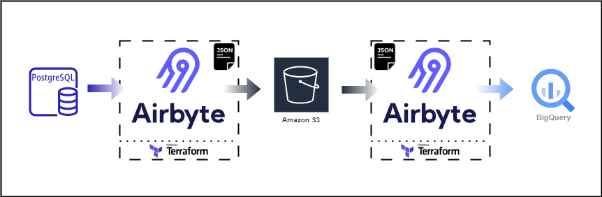

# Database Snapshot

Welcome to the "Database Snapshot" repository! This repo provides a quickstart template for building a full data stack that creates a table snapshot from a database and stores it in an Amazon S3 bucket as a JSONL file using Airbyte and then loads the snapshot file to a preferred data warehouse, also using Airbyte. 

In this quickstart, we will easily snapshot a sample table from Postgres and then load the table snapshot into BigQuery. The snapshot creation from the database and snapshot loading into the data warehouse are scheduled as one time operations. While this template doesn't delve into specific data, its goal is to showcase the synergy of these tools.

Like other quickstarts, this is designed to minimize setup hassles and propel you forward.

## Table of Contents

- [Database Snapshot](#database-snapshot)
  - [Table of Contents](#table-of-contents)
  - [Infrastructure Layout](#infrastructure-layout)
  - [Prerequisites](#prerequisites)
  - [1. Setting an environment for your project](#1-setting-an-environment-for-your-project)
  - [2. Setting Up Airbyte Connectors with Terraform](#2-setting-up-airbyte-connectors-with-terraform)
  - [3. Running the Stack](#3-running-the-stack)
  - [Next Steps](#next-steps)

## Infrastructure Layout


## Prerequisites

Before you embark on this integration, ensure you have the following set up and ready:

1. **Python 3.10 or later**: If not installed, download and install it from [Python's official website](https://www.python.org/downloads/).

2. **Docker and Docker Compose (Docker Desktop)**: Install [Docker](https://docs.docker.com/get-docker/) following the official documentation for your specific OS.

3. **Airbyte OSS version**: Deploy the open-source version of Airbyte. Follow the installation instructions from the [Airbyte Documentation](https://docs.airbyte.com/quickstart/deploy-airbyte/).

4. **Terraform**: Terraform will help you provision and manage the Airbyte resources. If you haven't installed it, follow the [official Terraform installation guide](https://developer.hashicorp.com/terraform/tutorials/aws-get-started/install-cli).


## 1. Setting an environment for your project

Get the project up and running on your local machine by following these steps:

1. **Clone the repository (Clone only this quickstart)**:  
   ```bash
   git clone --filter=blob:none --sparse  https://github.com/airbytehq/quickstarts.git
   ```

   ```bash
   cd quickstarts
   ```

   ```bash
   git sparse-checkout add database_snapshot
   ```

   
2. **Navigate to the directory**:  
   ```bash
   cd database_snapshot
   ```

3. **Set Up a Virtual Environment**:  
   - For Mac:
     ```bash
     python3 -m venv venv
     source venv/bin/activate
     ```
   - For Windows:
     ```bash
     python -m venv venv
     .\venv\Scripts\activate
     ```

4. **Install Dependencies**:  
   ```bash
   pip install -e ".[dev]"
   ```

## 2. Setting Up Airbyte Connectors with Terraform

Airbyte allows you to create connectors for sources and destinations, facilitating data synchronization between various platforms. In this project, we're harnessing the power of Terraform to automate the creation of these connectors and the connections between them. Here's how you can set this up:

1. **Navigate to the Airbyte Configuration Directory**:
   
   Change to the relevant directory containing the Terraform configuration for Airbyte:
   ```bash
   cd infra/airbyte
   ```

2. **Modify Configuration Files**:

   Within the `infra/airbyte` directory, you'll find three crucial Terraform files:
    - `provider.tf`: Defines the Airbyte provider.
    - `main.tf`: Contains the main configuration for creating Airbyte resources.
    - `variables.tf`: Holds various variables, including credentials.

   You'll also find three crucial Terraform modules:
    - `connections`: Contains the configuration files for the Airbyte connections.
    - `destinations`: Contains the configuration files for the Airbyte destination connector(s).
    - `sources`: Contains the configuration files for the Airbyte source connector(s).

   In each terraform module, you will find the following Terraform configuration files:
    - `provider.tf`: Defines the Airbyte provider.
    - `main.tf`: Contains the main configuration for creating Airbyte resources.
    - `variables.tf`: Holds various variables, including credentials.
    - `outputs.tf`: Defines exported data or metadata about your resources.

   Adjust the configurations in these files to suit your project's needs. Specifically, provide credentials for your Postgres, S3 (source and destination) and BigQuery connections. You can utilize the `variables.tf` files to manage these credentials.

3. **Initialize Terraform**:
   
   This step prepares Terraform to create the resources defined in your configuration files.
   ```bash
   terraform init
   ```

4. **Review the Plan**:

   Before applying any changes, review the plan to understand what Terraform will do.
   ```bash
   terraform plan
   ```

5. **Apply Configuration**:

   After reviewing and confirming the plan, apply the Terraform configurations to create the necessary Airbyte resources. A few things to note:

   1. The S3 source connector will not be created if a bucket with the same name specified is not present is S3.
   2. JSONL files have to be present in the specified bucket path. Otherwise, the snapshot loading connection (S3 to BigQuery) will not be created because the absence of the JSONL files will prevent Airbyte from detecting a stream.

   Fixing the first issue (if you encounter it) is straightforward - just create a new bucket with a unique name. However, since you will be snapshotting the database table for the first time, you will definitely have to fix the second issue before you proceed. There are 2 options for this:

   1. **(Recommended)** Run the snapshot operation first. This populates the S3 bucket with actual JSONL files for the loading connection to pick up for stream detection. Then, create the loading connection and run it.
   2. Upload an empty JSONL file to your S3 bucket with the bucket path you have specified in the destination connector config.

   Now proceed to create the Airbyte resources.

   ```bash
   terraform apply
   ```

   You will get an error that the `S3 to BigQuery` connection cannot be created. Ignore this and proceed. You should now have 5 resources (4 connectors and 1 connection) created in you Airbyte environment;

   1. The Postgres Database Source
   2. The S3 Destination
   3. The S3 Source
   4. The BigQuery Destination
   5. The Postgres to S3 Conneection

   Confirm this by running the command below

   ```bash
   terraform state list
   ```

6. **Verify in Airbyte UI**:

   Once Terraform completes its tasks, navigate to the Airbyte UI. Here, you should see your source and destination connectors, as well as the connection between them, set up and ready to go.

## 3. Running the Stack

After verifying that the 4 connectors and 1 connection have been created, you can proceed to run the snapshot operation.

1. **Run the Database Snapshot**:
   
   Navigate to the `Postgres to S3` connection and click `Sync now` to snapshot the database table and save it to your S3.

2. **Create the Loading Connection**:

   Once the snapshot has successfully completed, navigate back to your terraform home directory and create the second connection.

    ```bash
   terraform apply
   ```

   Now you should not see an error since the JSONL files are now present in the S3 bucket. Verify that the connection was created in the Airbyte UI and proceed to `Sync now`.

   You should now have your table snapshot loaded to your data warehouse.


## Next Steps

Once you've set up and launched this initial integration, the real power lies in its adaptability and extensibility. Here’s a roadmap to help you customize and harness this project tailored to your specific data needs:

1. **Add more Tables from Database**:

   You can add more tables from your database to snapshot.

2. **Create dbt transformations**:

   You can create transformations using dbt, depending on your use case for the loaded data in your data warehouse. Add SQL transformations in dbt.

3. **Scheduling**:

   You can run both the snapshot and the snapshot loading syncs on schedule depending on your use case. This can be done within Airbyte. For extensibility, you can use workflow orchestration tools like Dagster, Airflow or Prefect.

4. **Extend the Project**:

   The real beauty of this integration is its extensibility. Whether you want to add more data sources, integrate additional tools, or enhance your transformation logic – the floor is yours. With the foundation set, sky's the limit for how you want to extend and refine your data processes.