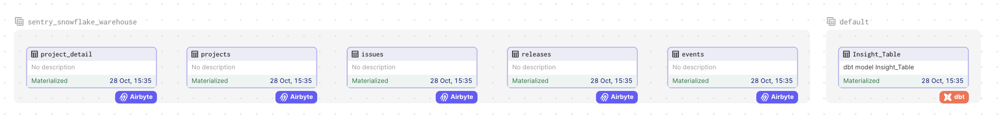
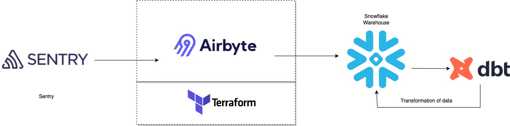

# Optimizing error resolution with Sentry, Airbyte, dbt, dagster and Snowflake

Welcome to the "Optimizing Error Resolution Processes with Sentry Stack" repository. This quickstart guide is designed to assist you in configuring an error analysis stack utilizing Sentry, Airbyte, Snowflake, dbt, and Dagster. Within this framework, error data extracted from Sentry is ingested into Snowflake through the use of Airbyte. Subsequently, data transformations are performed using dbt, and the results can be visually presented through Dagster.

Please find below the detailed steps for setting up the quickstart. 


## Table of Contents

- [Data flow Diagram](#data-flow-diagram)
- [Infrastructure Layout](#infrastructure-layout)
- [Prerequisites](#prerequisites)
- [Setting an environment for your project](#setting-an-environment-for-your-project)
  - There are two ways to setup the connectors of airbyte.
    - [1. Using Airbyte UI](#1-using-airbyte-ui)
    - [2. Using Terraform to Setup the Connector](#2-using-terraform-to-setup-the-connector)
- [Setting Up the dbt Project](#4-setting-up-the-dbt-project)
- [Orchestrating with Dagster](#5-orchestrating-with-dagster)
- [Next Steps](#next-steps)

## Data Flow Diagram



## Infrastructure Layout



## Prerequisites

Before you embark on this integration, ensure you have the following set up and ready:

1. **Python 3.10 or later**: If not installed, download and install it from [Python's official website](https://www.python.org/downloads/).

2. **Docker and Docker Compose (Docker Desktop)**: Install [Docker](https://docs.docker.com/get-docker/) following the official documentation for your specific OS.

3. **Airbyte OSS version**: Deploy the open-source version of Airbyte. Follow the installation instructions from the [Airbyte Documentation](https://docs.airbyte.com/quickstart/deploy-airbyte/).

4. **Terraform**: Terraform will help you provision and manage the Airbyte resources. If you haven't installed it, follow the [official Terraform installation guide](https://developer.hashicorp.com/terraform/tutorials/aws-get-started/install-cli).

5. **Snowflake account creation**: You will also need to add the necessary permissions to allow Airbyte and dbt to access the data in Snowflake. A step-by-step guide is provided [below](#2-setting-up-Snowflake).


## Setting an environment for your project

Get the project up and running on your local machine by following these steps:

1. **Clone the repository (Clone only this quickstart)**:  
   ```bash
   git clone --filter=blob:none --sparse  https://github.com/airbytehq/quickstarts.git
   ```

   ```bash
   cd quickstarts
   ```

   ```bash
   git sparse-checkout add error_analysis_stack_sentry
   ```


2. **Navigate to the directory**:  
   ```bash
   cd error_analysis_stack_sentry
   ```

3. **Set Up a Virtual Environment**:  
   - For Mac:
     ```bash
     python3 -m venv venv
     source venv/bin/activate
     ```
   - For Windows:
     ```bash
     python -m venv venv
     .\venv\Scripts\activate
     ```

4. **Install Dependencies**:  
   ```bash
   pip install -e ".[dev]"
   ```

## 1. Using Airbyte UI

To establish the connection and import data from the Sentry into the Snowflake warehouse, kindly proceed by utilizing the Airbyte user interface. The following steps should be adhered to:

1. Run the Airbyte OSS version by following the [documentation](https://docs.airbyte.com/quickstart/deploy-airbyte).

2. Setup the Sentry as source by following [these steps](https://docs.airbyte.com/integrations/sources/sentry).

3. Setup the Snowflake as destination by following [these steps](https://docs.airbyte.com/integrations/destinations/snowflake)

4. Please proceed to configure the synchronization time and select the specific tables you wish to load into Snowflake from Sentry. You can make your selection from the list of available streams.

5. Enjoy :smile:, your data loaded into Snowflake data warehouse from Sentry.


## 2. Using Terraform to Setup the Connector

Airbyte enables you to make connections between different platforms by creating connectors for sources and destinations. In this project, we're using Terraform to automate the setup of these connectors and their connections. Here's how you can do it:

1. **Navigate to the Airbyte Configuration Directory**:
   
   Change to the relevant directory containing the Terraform configuration for Airbyte:
   ```bash
   cd infra/airbyte
   ```

2. **Modify Configuration Files**:

   Within the `infra/airbyte` directory, you'll find three crucial Terraform files:
    - `provider.tf`: Defines the Airbyte provider.
    - `main.tf`: Contains the main configuration for creating Airbyte resources.
    - `variables.tf`: Holds various variables, including credentials.

   Adjust the configurations in these files to suit your project's needs. Specifically, provide credentials for your Sentry and Snowflake connections. You can utilize the `variables.tf` file to manage these credentials.

3. **Initialize Terraform**:
   
   This step prepares Terraform to create the resources defined in your configuration files.
   ```bash
   terraform init
   ```

4. **Review the Plan**:

   Before applying any changes, review the plan to understand what Terraform will do.
   ```bash
   terraform plan
   ```

5. **Apply Configuration**:

   After reviewing and confirming the plan, apply the Terraform configurations to create the necessary Airbyte resources.
   ```bash
   terraform apply
   ```

6. **Verify in Airbyte UI**:

   After Terraform finishes its tasks, go to the Airbyte user interface. You will find your source and destination connectors already set up, along with the connection between them, all ready to use.


## 4. Setting Up the dbt Project

[dbt (data build tool)](https://www.getdbt.com/) allows you to transform your data by writing, documenting, and executing SQL workflows. Setting up the dbt project requires specifying connection details for your data platform, in this case, Snowflake. Here’s a step-by-step guide to help you set this up:

First set up the dbt into your local machine by following steps from this [Link](https://docs.getdbt.com/docs/core/installation).

1. **Navigate to the dbt Project Directory**:

   Change to the directory containing the dbt configuration:
   ```bash
   cd dbt_project
   ```

2. **Update Connection Details**:

   You'll find a `profiles.yml` file within the directory. This file contains configurations for dbt to connect with your data platform. Update this file with your Snowflake connection details.

3. **Utilize Environment Variables (Optional but Recommended)**:

   To keep your credentials secure, you can leverage environment variables. An example is provided within the `profiles.yml` file.

4. **Test the Connection**:

   Once you’ve updated the connection details, you can test the connection to your Snowflake instance using:
   ```bash
   dbt debug
   ```

   If everything is set up correctly, this command should report a successful connection to Snowflake.

5. **Run the Models**:

   If you would like to run the dbt models manually at this point, you can do so by executing:
      ```bash
   dbt run
   ```

   You can verify the data has been transformed by going to Snowflake and checking the dataset name that you provided.

## 5. Orchestrating with Dagster

[Dagster](https://dagster.io/) is a modern data orchestrator designed to help you build, test, and monitor your data workflows. In this section, we'll walk you through setting up Dagster to oversee both the Airbyte and dbt workflows:

1. **Navigate to the Orchestration Directory**:

   Switch to the directory containing the Dagster orchestration configurations:
   ```bash
   cd orchestration
   ```

2. **Set Environment Variables**:

   Dagster requires certain environment variables to be set to interact with other tools like dbt and Airbyte. Set the following variables:

   ```bash
   export DAGSTER_DBT_PARSE_PROJECT_ON_LOAD=1
   export AIRBYTE_PASSWORD=password
   ```
   
   Note: The `AIRBYTE_PASSWORD` is set to `password` as a default for local Airbyte instances. If you've changed this during your Airbyte setup, ensure you use the appropriate password here.


3. **Launch the Dagster UI**:

   With the environment variables in place, kick-start the Dagster UI:
   ```bash
   dagster dev
   ```

4. **Access Dagster in Your Browser**:

   Open your browser and navigate to:
   ```
   http://127.0.0.1:3000
   ```

   Here, you should see assets for both Airbyte and dbt. To get an overview of how these assets interrelate, click on "view global asset lineage". This will give you a clear picture of the data lineage, visualizing how data flows between the tools.

5. **Materialize Dagster Assets**:
   In the Dagster UI, click on "Materialize all". This should trigger the full pipeline. First the Airbyte sync to extract data from Faker and load it into Snowflake, and then dbt to transform the raw data, materializing the `staging` and `marts` models.

## Next Steps

Congratulations on deploying and running the Error analysis Quickstart! 🎉 Here are some suggestions on what you can explore next to dive deeper and get more out of your project:

### **Explore the Data and Insights**
   - Dive into the datasets in Snowflake, run some queries, and explore the data you've collected and transformed. This is your chance to uncover insights and understand the data better!

### **Optimize Your dbt Models**
   - Review the transformations you’ve applied using dbt. Try optimizing the models or create new ones based on your evolving needs and insights you want to extract.


