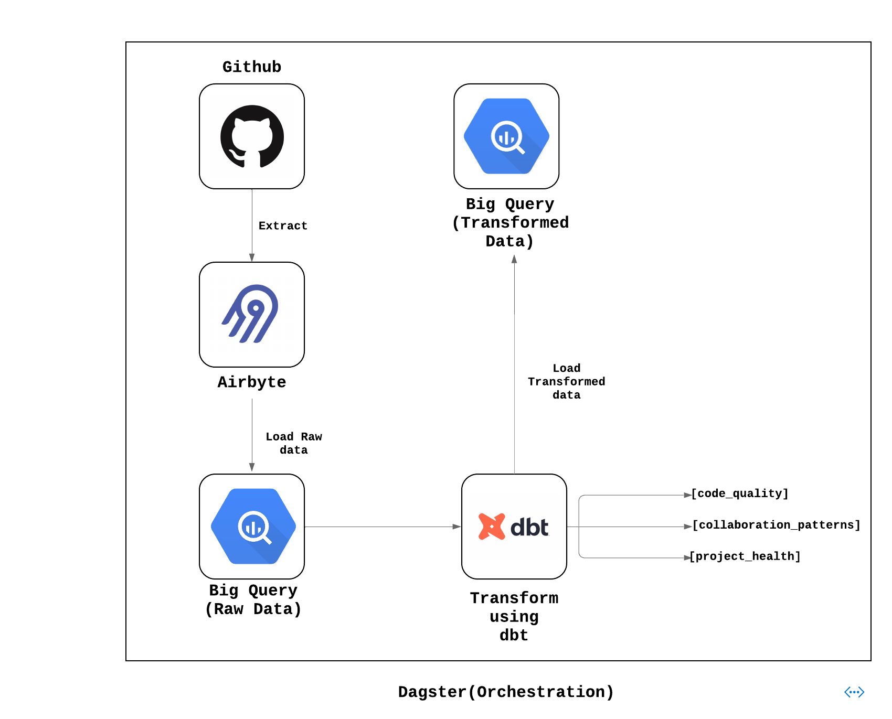

# Github Insight Stack with Airbyte, dbt, Dagster and BigQuery

Welcome to the "GitHub Analytics Stack" repository! 🌟 This is your ultimate destination to seamlessly set up a data stack using Airbyte, dbt, and GitHub API. With this configuration, you can extract repository, commit, and pull request data from GitHub, transform it, and glean insights into code quality, collaboration patterns, and project health.

Dive in and discover how smoothly these tools integrate for an enriched data analytics experience!

## Table of Contents

- [Prerequisites](#prerequisites)
- [Architecture Layout](#architecture-layout)
- [Setting an environment for your project](#1-setting-an-environment-for-your-project)
- [Setting Up BigQuery to work with Airbyte and dbt](#2-setting-up-bigquery)
- [Setting Up Airbyte Connectors with Terraform](#3-setting-up-airbyte-connectors-with-terraform)
- [Setting Up the dbt Project](#4-setting-up-the-dbt-project)
- [Next Steps](#next-steps)

## Prerequisites

Before you embark on this integration, ensure you have the following set up and ready:

1. **Python 3.10 or later**: If not installed, download and install it from [Python's official website](https://www.python.org/downloads/).

2. **Docker and Docker Compose (Docker Desktop)**: Install [Docker](https://docs.docker.com/get-docker/) following the official documentation for your specific OS.

3. **Airbyte OSS version**: Deploy the open-source version of Airbyte. Follow the installation instructions from the [Airbyte Documentation](https://docs.airbyte.com/quickstart/deploy-airbyte/).

4. **Terraform**: Terraform will help you provision and manage the Airbyte resources. If you haven't installed it, follow the [official Terraform installation guide](https://developer.hashicorp.com/terraform/tutorials/aws-get-started/install-cli).

5. **Google Cloud account with BigQuery**: You will also need to add the necessary permissions to allow Airbyte and dbt to access the data in BigQuery. A step-by-step guide is provided [below](#2-setting-up-bigquery).

## Architecture Layout


## 1. Setting an environment for your project

Get the project up and running on your local machine by following these steps:

1. **Clone the repository (Clone only this quickstart)**:  
   ```bash
   git clone --filter=blob:none --sparse  https://github.com/airbytehq/quickstarts.git
   ```

   ```bash
   cd quickstarts
   ```

   ```bash
   git sparse-checkout add github_insight_stack
   ```


2. **Navigate to the directory**:  
   ```bash
   cd github_insight_stack
   ```

3. **Set Up a Virtual Environment**:  
   - For Mac:
     ```bash
     python3 -m venv venv
     source venv/bin/activate
     ```
   - For Windows:
     ```bash
     python -m venv venv
     .\venv\Scripts\activate
     ```

4. **Install Dependencies**:  
   ```bash
   pip install -e ".[dev]"
   ```

## 2. Setting Up BigQuery

#### 1. **Create a Google Cloud Project**
   - If you have a Google Cloud project, you can skip this step.
   - Go to the [Google Cloud Console](https://console.cloud.google.com/).
   - Click on the "Select a project" dropdown at the top right and select "New Project".
   - Give your project a name and follow the steps to create it.

#### 2. **Create BigQuery Datasets**
   - In the Google Cloud Console, go to BigQuery.
   - Make two new datasets: `raw_data` for Airbyte and `transformed_data` for dbt.
     - If you pick different names, remember to change the names in the code too.
   
   **How to create a dataset:**
   - In the left sidebar, click on your project name.
   - Click “Create Dataset”.
   - Enter the dataset ID (either `raw_data` or `transformed_data`).
   - Click "Create Dataset".

#### 3. **Create Service Accounts and Assign Roles**
   - Go to “IAM & Admin” > “Service accounts” in the Google Cloud Console.
   - Click “Create Service Account”.
   - Name your service account (like `airbyte-service-account`).
   - Assign the “BigQuery Data Editor” and “BigQuery Job User” roles to the service account.
   - Follow the same steps to make another service account for dbt (like `dbt-service-account`) and assign the roles.

   **How to create a service account and assign roles:**
   - While creating the service account, under the “Grant this service account access to project” section, click the “Role” dropdown.
   - Choose the “BigQuery Data Editor” and “BigQuery Job User” roles.
   - Finish the creation process.
   
#### 4. **Generate JSON Keys for Service Accounts**
   - For both service accounts, make a JSON key to let the service accounts sign in.
   
   **How to generate JSON key:**
   - Find the service account in the “Service accounts” list.
   - Click on the service account name.
   - In the “Keys” section, click “Add Key” and pick JSON.
   - The key will download automatically. Keep it safe and don’t share it.
   - Do this for the other service account too.

## 3. Setting Up Airbyte Connectors with Terraform

Airbyte allows you to create connectors for sources and destinations, facilitating data synchronization between various platforms. In this project, we're harnessing the power of Terraform to automate the creation of these connectors and the connections between them. Here's how you can set this up:

1. **Navigate to the Airbyte Configuration Directory**:
   
   Change to the relevant directory containing the Terraform configuration for Airbyte:
   ```bash
   cd infra/airbyte
   ```

2. **Modify Configuration Files**:

   Within the `infra/airbyte` directory, you'll find three crucial Terraform files:
    - `provider.tf`: Defines the Airbyte provider.
    - `main.tf`: Contains the main configuration for creating Airbyte resources.
    - `variables.tf`: Holds various variables, including credentials.

   Adjust the configurations in these files to suit your project's needs. Specifically, provide credentials for your BigQuery connection. You can utilize the `variables.tf` file to manage these credentials.

3. **Initialize Terraform**:
   
   This step prepares Terraform to create the resources defined in your configuration files.
   ```bash
   terraform init
   ```

4. **Review the Plan**:

   Before applying any changes, review the plan to understand what Terraform will do.
   ```bash
   terraform plan
   ```

5. **Apply Configuration**:

   After reviewing and confirming the plan, apply the Terraform configurations to create the necessary Airbyte resources.
   ```bash
   terraform apply
   ```

6. **Verify in Airbyte UI**:

   Once Terraform completes its tasks, navigate to the [Airbyte UI](http://localhost:8000/). Here, you should see your source and destination connectors, as well as the connection between them, set up and ready to go.

7. **Add Normalization to the Airbyte Connection**: 

   At the moment of creating this Quickstart, it's not possible to select normalization via Terraform, so you need to select that manually. In the Airbyte UI, go to the "Connections" tab, select the "Faker to BigQuery" connection, go to the "Transformation" tab and select "Normalized tabular data" and save your changes.

## 4. Setting Up the dbt Project

[dbt (data build tool)](https://www.getdbt.com/) allows you to transform your data by writing, documenting, and executing SQL workflows. Setting up the dbt project requires specifying connection details for your data platform, in this case, BigQuery. Here’s a step-by-step guide to help you set this up:

1. **Navigate to the dbt Project Directory**:

   Change to the directory containing the dbt configuration:
   ```bash
   cd dbt_project
   ```

2. **Update Connection Details**:

   You'll find a `profiles.yml` file within the directory. This file contains configurations for dbt to connect with your data platform. Update this file with your BigQuery connection details.

3. **Utilize Environment Variables (Optional but Recommended)**:

   To keep your credentials secure, you can leverage environment variables. An example is provided within the `profiles.yml` file.

4. **Test the Connection**:

   Once you’ve updated the connection details, you can test the connection to your BigQuery instance using:
   ```bash
   dbt debug
   ```

   If everything is set up correctly, this command should report a successful connection to BigQuery.

5. **Run the Models**:

   If you would like to run the dbt models manually at this point, you can do so by executing:
      ```bash
   dbt run
   ```

   You can verify the data has been transformed by going to BigQuery and checking the `transformed_data` dataset.

## 5. Orchestrating with Dagster

[Dagster](https://dagster.io/) is a modern data orchestrator designed to help you build, test, and monitor your data workflows. In this section, we'll walk you through setting up Dagster to oversee both the Airbyte and dbt workflows:

1. **Navigate to the Orchestration Directory**:

   Switch to the directory containing the Dagster orchestration configurations:
   ```bash
   cd orchestration
   ```

2. **Set Environment Variables**:

   Dagster requires certain environment variables to be set to interact with other tools like dbt and Airbyte. Set the following variables:

   ```bash
   export DAGSTER_DBT_PARSE_PROJECT_ON_LOAD=1
   export AIRBYTE_PASSWORD=password
   ```
   
   Note: The `AIRBYTE_PASSWORD` is set to `password` as a default for local Airbyte instances. If you've changed this during your Airbyte setup, ensure you use the appropriate password here.

3. **Launch the Dagster UI**:

   With the environment variables in place, kick-start the Dagster UI:
   ```bash
   dagster dev
   ```

4. **Access Dagster in Your Browser**:

   Open your browser and navigate to:
   ```
   http://127.0.0.1:3000
   ```

   Here, you should see assets for both Airbyte and dbt. To get an overview of how these assets interrelate, click on "view global asset lineage". This will give you a clear picture of the data lineage, visualizing how data flows between the tools.

5. **Materialize Dagster Assets**:
   In the Dagster UI, you can initiate your data workflows:
   Begin with the Airbyte sync to extract data from GitHub and send it to BigQuery.
   Next, execute dbt transformations based on the specific models you've developed:
   
   - code_quality
   - collaboration_patterns
   - project_health

In the Dagster UI, these models should be materialized, showing the transformed GitHub data according to the logic you've implemented in dbt.

When you build custom pipelines in Dagster, make sure they reflect your dbt model names and dependencies. For example, if one model depends on the output of another, ensure that your Dagster pipeline respects this order of execution.

The central idea is to adjust the orchestration setup so it maps directly to your dbt model names and the dependencies among them. Remember, the success of the orchestration will also depend on the correct setup and error-free state of the individual dbt models and Airbyte configurations.


## Next Steps

Kudos on setting up the GitHub Insight Stack! 🎉 Here’s how you can amplify your analytics capabilities:

### 1. Analyze Collaboration Patterns:

    Examine the frequency, nature, and spread of commits and pull requests across repositories.

### 2. Evaluate Code Quality:

    Monitor pull request acceptance rates, time to merge, and frequency of commits to assess project health and contributor efficiency.

### 3. Expand Data Horizons:

    Bring in more GitHub data or integrate other platforms using Airbyte to enrich your dataset.

### 4. Improve Transformations:

    Refine your dbt models to get more nuanced insights.

### 5. Scale and Monitor:

    Optimize configurations for larger datasets and establish monitoring to ensure data flow remains smooth.

### 6. Engage with the Community:

    Share findings, models, or new configurations with the community. Contribute to repositories and help foster collective growth.
