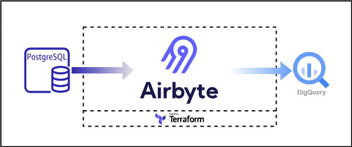

# Low-Latency Data Availability Stack

Welcome to the "Low-Latency Data Availability Stack" repository! This repo provides a quickstart template for building a Low-Latency Data Availability solution that syncs data from an existing Postgres database to a BigQuery dataset using Airbyte. We will easily replicate the tables and data from the Postgres database to BigQuery with Airbyte using Change Data Capture (CDC) and Postgres Write Ahead Log (WAL). This quickstart also explores using Airbyte Postgres features to ensure near real-time data availability and access. While this template doesn't delve into specific data, its goal is to showcase how the low latency data solution can be achieved with Airbyte.

Just like other Airbyte quickstarts, this quickstart is designed to minimize setup hassles and propel you forward.

## Table of Contents

- [Low-Latency Data Availability Stack](#low-latency-data-availability-stack)
  - [Table of Contents](#table-of-contents)
  - [Infrastructure Layout](#infrastructure-layout)
  - [Prerequisites](#prerequisites)
  - [1. Setting an environment for your project](#1-setting-an-environment-for-your-project)
  - [2. Setting Up Airbyte Connectors with Terraform](#2-setting-up-airbyte-connectors-with-terraform)
  - [3. Achieving Low Latency with Airbyte](#3-achieving-low-latency-with-airbyte)
  - [Next Steps](#next-steps)


## Infrastructure Layout



## Prerequisites

Before you embark on this integration, ensure you have the following set up and ready:

1. **Python 3.10 or later**: If not installed, download and install it from [Python's official website](https://www.python.org/downloads/).

2. **Docker and Docker Compose (Docker Desktop)**: Install [Docker](https://docs.docker.com/get-docker/) following the official documentation for your specific OS.

3. **Airbyte OSS version**: Deploy the open-source version of Airbyte. Follow the installation instructions from the [Airbyte Documentation](https://docs.airbyte.com/quickstart/deploy-airbyte/).

4. **Terraform**: Terraform will help you provision and manage the Airbyte resources. If you haven't installed it, follow the [official Terraform installation guide](https://developer.hashicorp.com/terraform/tutorials/aws-get-started/install-cli).


## 1. Setting an environment for your project

Get the project up and running on your local machine by following these steps:

1. **Clone the repository (Clone only this quickstart)**:  
   ```bash
   git clone --filter=blob:none --sparse  https://github.com/airbytehq/quickstarts.git
   ```

   ```bash
   cd quickstarts
   ```

   ```bash
   git sparse-checkout add low_latency_data_availability
   ```

   
2. **Navigate to the directory**:  
   ```bash
   cd low_latency_data_availability
   ```

3. **Set Up a Virtual Environment**:  
   - For Mac:
     ```bash
     python3 -m venv venv
     source venv/bin/activate
     ```
   - For Windows:
     ```bash
     python -m venv venv
     .\venv\Scripts\activate
     ```

4. **Install Dependencies**:  
   ```bash
   pip install -e ".[dev]"
   ```

## 2. Setting Up Airbyte Connectors with Terraform

Airbyte allows you to create connectors for sources and destinations, facilitating data synchronization between various platforms. In this project, we're harnessing the power of Terraform to automate the creation of these connectors and the connections between them. Here's how you can set this up:

1. **Navigate to the Airbyte Configuration Directory**:
   
   Change to the relevant directory containing the Terraform configuration for Airbyte:
   ```bash
   cd infra/airbyte
   ```

2. **Modify Configuration Files**:

   Within the `infra/airbyte` directory, you'll find three crucial Terraform files:
    - `provider.tf`: Defines the Airbyte provider.
    - `main.tf`: Contains the main configuration for creating Airbyte resources.
    - `variables.tf`: Holds various variables, including credentials.

   Adjust the configurations in these files to suit your project's needs. Specifically, provide credentials for your Postgres and BigQuery connections. You can utilize the `variables.tf` file to manage these credentials.

3. **Initialize Terraform**:
   
   This step prepares Terraform to create the resources defined in your configuration files.
   ```bash
   terraform init
   ```

4. **Review the Plan**:

   Before applying any changes, review the plan to understand what Terraform will do.
   ```bash
   terraform plan
   ```

5. **Apply Configuration**:

   After reviewing and confirming the plan, apply the Terraform configurations to create the necessary Airbyte resources.
   ```bash
   terraform apply
   ```

6. **Verify in Airbyte UI**:

   Once Terraform completes its tasks, navigate to the Airbyte UI. Here, you should see your Postgres source and BigQuery destination connectors, as well as the connection between them, set up and ready to go.

## 3. Achieving Low Latency with Airbyte

Using Airbyte for the data replication offers the following for achieving low latency;

- Throughput performances for the Postgres source connector are about 11 MB per second. This offers users the capability to sync Terabytes of tables is a fast, reliable manner.
- For very large database tables, the data are read in chunks. This caters for reliability issues due to the strain on the server or network issues. These chunks are either read successively or even concurrently.
- [Checkpointing](https://docs.airbyte.com/understanding-airbyte/airbyte-protocol/#state--checkpointing). This happens when there is a network error or a server going down for maintenance during a sync operation. Airbyte stores the state of a sync such that we can restart from a known point. This is known as the [CTID](https://enterprisedb.com/postgres-tutorials/what-equivalent-rowid-postgresql#:~:text=The%20ctid%20field%20is%20a,the%20location%20of%20the%20tuple.) markers. Thus, if there is an error, we can restart our read from a last known saved checkpoint.
- Once an initial sync is done, for subsequent incremental syncs, Airbyte can use either of 3 [options](https://docs.airbyte.com/integrations/sources/postgres#postgres-replication-methods) that depend on a reliable cursor to be able to find data that has changed. These options are;
  -  [CDC](https://docs.airbyte.com/integrations/sources/postgres#cdc),
  -  [xmin](https://docs.airbyte.com/integrations/sources/postgres#xmin), or 
  -  a user column.

   For this quickstart, we will be using the CDC option as it offers the least latency for high volume data sync. If your data is less than 500GB, you can go for the xmin option.

## Next Steps

Once you've set up and launched this initial integration, you can proceed to sync the connection to trigger the data sync. The real power of this quickstart lies in its adaptability and extensibility. Here’s a roadmap to help you customize and harness this project tailored to your specific data needs:

1. **Plan your Data Replication**:

   Ideally, database replication should be a planned activity. Do not run a data replication job during a production peak. Data latency depends on factors such as the size of data to be moved, geographic location of the source and destination, and other parameters. Ensure you test thoroughly before deploying to production.
   
2. **Extend the Project**:

   The real beauty of this integration is its extensibility. Whether you want to add more Postgres sources, integrate additional tools, or modify the sync schedule – the floor is yours. The granularity of the replication can also be set by selecting the correct sync mode for each stream (table). Read [sync mode](https://docs.airbyte.com/understanding-airbyte/connections/) for more details. With the foundation set, sky's the limit for how you want to extend and refine your data processes.
