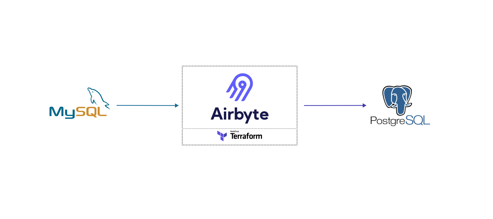

# Mysql to Postgres Incremental Stack

Welcome to the "Mysql to Postgres Incremental Stack" repository! This repo provides a quickstart template for building a one-off database migration solution from an existing MySQL database to a  Postgres database with incremental sync using Airbyte. We will easily migrate the tables and data from the MySQL database to the  Postgres database with Airbyte using Change Data Capture (CDC). While this template doesn't delve into specific data, its goal is to showcase how the database migration solution can be achieved with Airbyte.

Just like other Airbyte quickstarts, this quickstart is designed to minimize setup hassles and propel you forward.

## Table of Contents

- [Mysql to Postgres Incremental Stack](#mysql-to-postgres-incremental-stack)
  - [Table of Contents](#table-of-contents)
  - [Infrastructure Layout](#infrastructure-layout)
  - [Prerequisites](#prerequisites)
  - [1. Setting an environment for your project](#1-setting-an-environment-for-your-project)
  - [2. Setting Up Airbyte Connectors with Terraform](#2-setting-up-airbyte-connectors-with-terraform)
  - [Next Steps](#next-steps)


## Infrastructure Layout



## Prerequisites

Before you embark on this integration, ensure you have the following set up and ready:

1. **Python 3.10 or later**: If not installed, download and install it from [Python's official website](https://www.python.org/downloads/).

2. **Docker and Docker Compose (Docker Desktop)**: Install [Docker](https://docs.docker.com/get-docker/) following the official documentation for your specific OS.

3. **Airbyte OSS version**: Deploy the open-source version of Airbyte. Follow the installation instructions from the [Airbyte Documentation](https://docs.airbyte.com/quickstart/deploy-airbyte/).

4. **Terraform**: Terraform will help you provision and manage the Airbyte resources. If you haven't installed it, follow the [official Terraform installation guide](https://developer.hashicorp.com/terraform/tutorials/aws-get-started/install-cli).


## 1. Setting an environment for your project

Get the project up and running on your local machine by following these steps:

1. **Clone the repository (Clone only this quickstart)**:  
   ```bash
   git clone --filter=blob:none --sparse  https://github.com/airbytehq/quickstarts.git
   ```

   ```bash
   cd quickstarts
   ```

   ```bash
   git sparse-checkout add mysql_to_postgres_incremental_stack
   ```

   
2. **Navigate to the directory**:  
   ```bash
   cd mysql_to_postgres_incremental_stack
   ```

3. **Set Up a Virtual Environment**:  
   - For Mac:
     ```bash
     python3 -m venv venv
     source venv/bin/activate
     ```
   - For Windows:
     ```bash
     python -m venv venv
     .\venv\Scripts\activate
     ```

4. **Install Dependencies**:  
   ```bash
   pip install -e ".[dev]"
   ```

## 2. Setting Up Airbyte Connectors with Terraform

Airbyte allows you to create connectors for sources and destinations, facilitating data synchronization between various platforms. In this project, we're harnessing the power of Terraform to automate the creation of these connectors and the connections between them. Here's how you can set this up:

1. **Navigate to the Airbyte Configuration Directory**:
   
   Change to the relevant directory containing the Terraform configuration for Airbyte:
   ```bash
   cd infra/airbyte
   ```

2. **Modify Configuration Files**:

   Within the `infra/airbyte` directory, you'll find three crucial Terraform files:
    - `provider.tf`: Defines the Airbyte provider.
    - `main.tf`: Contains the main configuration for creating Airbyte resources.
    - `variables.tf`: Holds various variables, including credentials.

   Adjust the configurations in these files to suit your project's needs. Specifically, provide credentials for your Postgres and MySQL connections. You can utilize the `variables.tf` file to manage these credentials.

3. **Initialize Terraform**:
   
   This step prepares Terraform to create the resources defined in your configuration files.
   ```bash
   terraform init
   ```

4. **Review the Plan**:

   Before applying any changes, review the plan to understand what Terraform will do.
   ```bash
   terraform plan
   ```

5. **Apply Configuration**:

   After reviewing and confirming the plan, apply the Terraform configurations to create the necessary Airbyte resources.
   ```bash
   terraform apply
   ```

6. **Verify in Airbyte UI**:

   Once Terraform completes its tasks, navigate to the Airbyte UI. Here, you should see your Postgres source and MySQL destination connectors, as well as the connection between them, set up and ready to go.

## Next Steps

Once you've set up and launched this initial integration, you can proceed to sync the connection to trigger a one-off migration. The real power of this quickstart lies in its adaptability and extensibility. Here’s a roadmap to help you customize and harness this project tailored to your specific data needs:


1. **Extend the Project**:

   The real beauty of this integration is its extensibility. Whether you want to add more MySQL sources, migrate to more than one Postgres databases, integrate additional tools, or modify the sync schedule – the floor is yours. The granularity of the migration can also be set by selecting the correct sync mode for each stream (table). Read [sync mode](https://docs.airbyte.com/understanding-airbyte/connections/) for more details. With the foundation set, sky's the limit for how you want to extend and refine your data processes.
