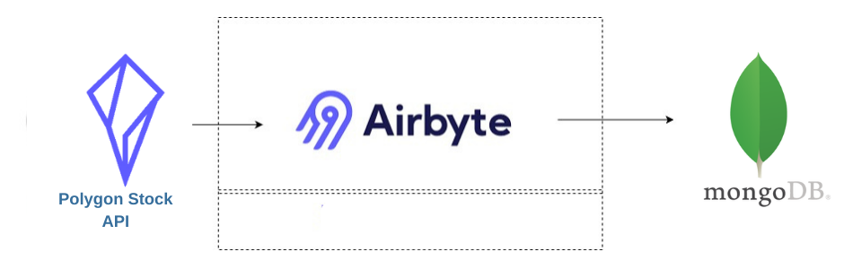
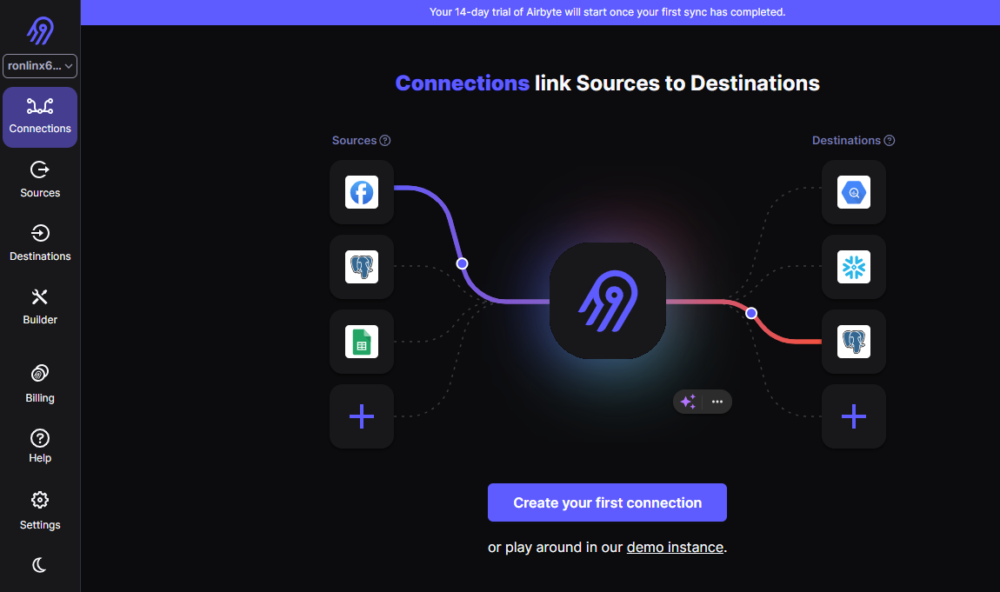
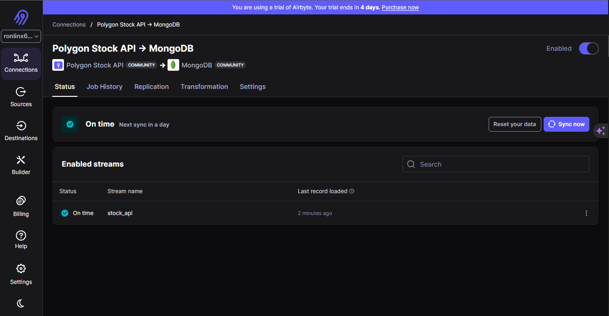

# Stock Data Analytics with Airbyte, Polygon Stock API, and MongoDB

Welcome to the Quickstart guide for "Stock Data Analytics." 🌟 This guide is your gateway to effortlessly establishing a data stack that combines the power of Airbyte, the Polygon Stock API, and MongoDB. With this streamlined setup, you can seamlessly retrieve stock data from the Polygon Stock API, store it in MongoDB, create aggregations, set up pipelines, and perform in-depth trend analysis.

Our goal is to simplify the process, help you get started promptly, and demonstrate the harmonious collaboration of these tools.

Here is a visual representation of how data flows through our integrated tools in this Quickstart.

## Table of Contents

- [Stock Data Analytics with Airbyte, Polygon Stock API, and MongoDB](#stock-data-analytics-with-airbyte-polygon-stock-api-and-mongodb)
  - [Table of Contents](#table-of-contents)
  - [1. Getting Started with AirByte UI](#1-getting-started-with-airbyte-ui)
  - [2. Getting Polygon Stock API](#2-getting-polygon-stock-api)
      - [Step 1: Navigate to Polygon](#step-1-navigate-to-polygon)
      - [Step 2: Login into the Dashboard](#step-2-login-into-the-dashboard)
      - [Step 3: Get the Stock API](#step-3-get-the-stock-api)
  - [3. Establishing Polygon as Source](#3-establishing-polygon-as-source)
      - [Step 1: Select Sources](#step-1-select-sources)
      - [Step 2: Create Polygon](#step-2-create-polygon)
      - [Step 3: Polygon API Settings](#step-3-polygon-api-settings)
      - [Step 4: Test Connection](#step-4-test-connection)
  - [4. Setting Up MongoDB Connector](#4-setting-up-mongodb-connector)
      - [Step 1: Visit MongDB](#step-1-visit-mongdb)
      - [Step 2: Create a cluster](#step-2-create-a-cluster)
      - [Step 3: Get cluster URL](#step-3-get-cluster-url)
      - [Step 4: Create Destination](#step-4-create-destination)
      - [Step 5: MongoDB Setup](#step-5-mongodb-setup)
      - [Step 7: Connection Test](#step-7-connection-test)
  - [5. Configuring AirByte Connector Settings](#5-configuring-airbyte-connector-settings)
      - [Step 1:](#step-1)
      - [Step 2:](#step-2)
      - [Step 3:](#step-3)
      - [Step 4:](#step-4)
  - [6. MongoDB Data Analysis](#6-mongodb-data-analysis)
  - [Next Steps](#next-steps)
    - [1. **Automate and Monitor Your Pipelines**](#1-automate-and-monitor-your-pipelines)
    - [2. **Scale Your Setup**](#2-scale-your-setup)
    - [3. **Contribute to the Community**](#3-contribute-to-the-community)

## 1. Getting Started with AirByte UI

To get started, make sure you have successfully installed and configured Airbyte's user interface (UI) on your system. You can follow the installation instructions provided in the [Airbyte Documentation](https://docs.airbyte.io/).

You can alternatively create a cloud account. In this quickstart, we shall primarily use the cloud  since we have the source and destination up on the interfaces.

## 2. Getting Polygon Stock API

You'll need access to the Polygon Stock API to retrieve real-time or historical stock data. Obtain API keys or necessary credentials from Polygon by signing up on their platform or following their API access instructions.

#### Step 1: Navigate to Polygon
Visit the Polygon website and sign up for an account if you haven't already.

#### Step 2: Login into the Dashboard
Log in to your Polygon account and navigate to the API section.

#### Step 3: Get the Stock API
Obtain your Polygon Stock API keys or credentials.

## 3. Establishing Polygon as Source

Set up your data source in Airbyte to connect to the Polygon Stock API. This involves creating a connection to Polygon and configuring it to access the stock data you require. Refer to the [Airbyte Documentation](https://docs.airbyte.io/) for guidance on establishing this source.

#### Step 1: Select Sources
In the Airbyte UI, navigate to the "Sources" section.

#### Step 2: Create Polygon
Click on "Create New Source", search and select "Polygon Stock API" as the source type.

#### Step 3: Polygon API Settings
Configure the source by providing your Polygon Stock API credentials, specifying the data you want to retrieve (e.g., real-time or historical stock data), and setting any additional parameters. Get help [here](https://github.com/airbytehq/airbyte/blob/master/docs/integrations/sources/polygon-stock-api.md) or watch video at the end.

#### Step 4: Test Connection
Test the source connection to ensure it's working correctly.

## 4. Setting Up MongoDB Connector

Ensure you have MongoDB installed and set up. You should have MongoDB ready to receive the stock data from Airbyte. If you haven't installed MongoDB yet, follow the installation instructions specific to your operating system on the [MongoDB website](https://www.mongodb.com/try/download/community).

#### Step 1: Visit MongDB
If you don't have a MongoDB Atlas account, sign up for one on the MongoDB Atlas website.

#### Step 2: Create a cluster
Create a MongoDB Atlas cluster in your Atlas account. You can follow the cluster creation instructions provided by MongoDB Atlas. Ensure to create a user and allow all IPs (0.0.0.0/0) for database access and rights.

#### Step 3: Get cluster URL
Obtain the connection details for your MongoDB Atlas cluster, including the connection string.

#### Step 4: Create Destination
In the Airbyte UI, navigate to the "Destinations" section. This usually comes automatically after Source is successfully tested.

#### Step 5: MongoDB Setup
Configure the MongoDB Atlas connector settings by providing the connection string, database credentials, and specifying the database and collection where you want to store the stock data.

#### Step 7: Connection Test
Test the connector settings to ensure the connection to MongoDB Atlas is successful.

## 5. Configuring AirByte Connector Settings

In Airbyte, configure the connector settings for MongoDB to define where and how the data will be stored. Make sure you have the necessary credentials and connection details ready to complete this step. Refer to the [Airbyte Documentation](https://docs.airbyte.io/) for guidance on configuring connectors.

#### Step 1: 
In the Airbyte UI, navigate to the "Destinations" section.

#### Step 2: 
Click on "Create New Destination" and select "MongoDB" as the destination type.

#### Step 3: 
Configure the MongoDB connector settings by providing the connection details (e.g., host, port), database credentials, and the database and collection names you created in Step 4.

#### Step 4: 
Test the connector settings to ensure the connection to MongoDB is successful.

## 6. MongoDB Data Analysis

After successfully setting up the data pipeline, you can start analyzing the data stored in MongoDB. Utilize tools or libraries of your choice, such as Python, MongoDB's native query language, or MongoDB-compatible data analysis tools, to perform stock data analysis, aggregations, and trend analysis.

With these prerequisites in place, you'll be well-prepared to embark on your stock data analytics journey using Airbyte, the Polygon Stock API, and MongoDB.

## Next Steps

Congratulations upon setting up the stock analysis using AirByte. I have created a video here to assist you more.

### 1. **Automate and Monitor Your Pipelines**
   - Explore more advanced Dagster configurations and setups to automate your pipelines further and set up monitoring and alerting to be informed of any issues immediately.

### 2. **Scale Your Setup**
   - Consider scaling your setup to handle more data, more sources, and more transformations. Optimize your configurations and resources to ensure smooth and efficient processing of larger datasets.

### 3. **Contribute to the Community**
   - Share your learnings, optimizations, and new configurations with the community. Contribute to the respective tool’s communities and help others learn and grow.