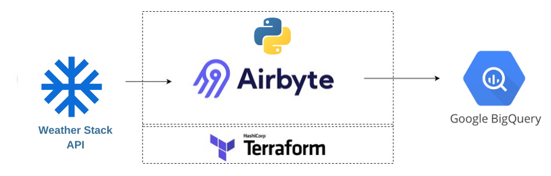

# Weather Data Stack with Airbyte, dbt, Dagster and BigQuery

Welcome to the "Weather Data Stack" repository! 🌟 This is your go-to place to easily set up a data stack using Airbyte, dbt, BigQuery, and Dagster. With this setup, you can pull weather data from WeatherStack API, put it into BigQuery, and play around with it using dbt and Dagster.

This Quickstart is all about making things easy, getting you started quickly and showing you how smoothly all these tools can work together!

## Table of Contents

- [Weather Data Stack with Airbyte, dbt, Dagster and BigQuery](#weather-data-stack-with-airbyte-dbt-dagster-and-bigquery)
  - [Table of Contents](#table-of-contents)
  - [Infrastracture Layout](#infrastracture-layout)
  - [Prerequisites](#prerequisites)
  - [1. Setting an environment for your project](#1-setting-an-environment-for-your-project)
  - [2. Weatherstack API Key](#2-weatherstack-api-key)
      - [1. Sign Up for a Weatherstack API Key](#1-sign-up-for-a-weatherstack-api-key)
  - [3. Setting Up BigQuery](#3-setting-up-bigquery)
      - [1. **Create a Google Cloud Project**](#1-create-a-google-cloud-project)
      - [2. **Create BigQuery Datasets**](#2-create-bigquery-datasets)
      - [3. **Create Service Accounts and Assign Roles**](#3-create-service-accounts-and-assign-roles)
      - [4. **Generate JSON Keys for Service Accounts**](#4-generate-json-keys-for-service-accounts)
  - [4. Setting Up Airbyte Connectors](#4-setting-up-airbyte-connectors)
    - [1. Setting Up Airbyte Connectors with AirByteUI](#1-setting-up-airbyte-connectors-with-airbyteui)
  - [5. Setting Up the dbt Project](#5-setting-up-the-dbt-project)
  - [Next Steps](#next-steps)
    - [1. **Explore the Data and Insights**](#1-explore-the-data-and-insights)
    - [2. **Optimize Your dbt Models**](#2-optimize-your-dbt-models)
    - [3. **Expand Your Data Sources**](#3-expand-your-data-sources)
    - [4. **Enhance Data Quality and Testing**](#4-enhance-data-quality-and-testing)
    - [5. **Automate and Monitor Your Pipelines**](#5-automate-and-monitor-your-pipelines)
    - [6. **Scale Your Setup**](#6-scale-your-setup)
    - [7. **Contribute to the Community**](#7-contribute-to-the-community)

## Infrastracture Layout


## Prerequisites

Before you embark on this integration, ensure you have the following set up and ready:

1. **Python 3.10 or later**: If not installed, download and install it from [Python's official website](https://www.python.org/downloads/).

2. **Docker and Docker Compose (Docker Desktop)**: Install [Docker](https://docs.docker.com/get-docker/) following the official documentation for your specific OS.

3. **Airbyte OSS version**: Deploy the open-source version of Airbyte. Follow the installation instructions from the [Airbyte Documentation](https://docs.airbyte.com/quickstart/deploy-airbyte/).

4. **Google Cloud account with BigQuery**: You will also need to add the necessary permissions to allow Airbyte and dbt to access the data in BigQuery. A step-by-step guide is provided [below](#2-setting-up-bigquery).

5. **Weather Stack API**: You can grab your free weather API from [here](https://weatherstack.com/) after account opening. No Credit card is required for the starter version

## 1. Setting an environment for your project

Get the project up and running on your local machine by following these steps:

1. **Clone the repository (Clone only this quickstart)**:  
   ```bash
   git clone --filter=blob:none --sparse  https://github.com/airbytehq/quickstarts.git
   ```

   ```bash
   cd quickstarts
   ```

   ```bash
   git sparse-checkout add weather_data_stack
   ```


2. **Navigate to the directory**:  
   ```bash
   cd weather_data_stack
   ```

3. **Set Up a Virtual Environment**:  
   - For Mac:
     ```bash
     python3 -m venv venv
     source venv/bin/activate
     ```
   - For Windows:
     ```bash
     python -m venv venv
     .\venv\Scripts\activate
     ```

4. **Install Dependencies**:  
   ```bash
   pip install -e ".[dev]"
   ```

## 2. Weatherstack API Key

To extract weather data from the Weatherstack API and store the API key in its own environment variable file, you can follow these steps:

#### 1. Sign Up for a Weatherstack API Key

1. Visit the [Weatherstack website](https://weatherstack.com/).
2. Sign up for an account or log in if you already have one.
3. Once logged in, go to the dashboard to obtain your API key.


## 3. Setting Up BigQuery

#### 1. **Create a Google Cloud Project**
   - If you have a Google Cloud project, you can skip this step.
   - Go to the [Google Cloud Console](https://console.cloud.google.com/).
   - Click on the "Select a project" dropdown at the top right and select "New Project".
   - Give your project a name and follow the steps to create it.

#### 2. **Create BigQuery Datasets**
   - In the Google Cloud Console, go to BigQuery.
   - Make two new datasets: `raw_data` for Airbyte and `transformed_data` for dbt.
     - If you pick different names, remember to change the names in the code too.
   
   **How to create a dataset:**
   - In the left sidebar, click on your project name.
   - Click “Create Dataset”.
   - Enter the dataset ID (either `raw_data` or `transformed_data`).
   - Click "Create Dataset".

#### 3. **Create Service Accounts and Assign Roles**
   - Go to “IAM & Admin” > “Service accounts” in the Google Cloud Console.
   - Click “Create Service Account”.
   - Name your service account (like `airbyte-service-account`).
   - Assign the “BigQuery Data Editor” and “BigQuery Job User” roles to the service account.
   - Follow the same steps to make another service account for dbt (like `dbt-service-account`) and assign the roles.

   **How to create a service account and assign roles:**
   - While creating the service account, under the “Grant this service account access to project” section, click the “Role” dropdown.
   - Choose the “BigQuery Data Editor” and “BigQuery Job User” roles.
   - Finish the creation process.
   
#### 4. **Generate JSON Keys for Service Accounts**
   - For both service accounts, make a JSON key to let the service accounts sign in.
   
   **How to generate JSON key:**
   - Find the service account in the “Service accounts” list.
   - Click on the service account name.
   - In the “Keys” section, click “Add Key” and pick JSON.
   - The key will download automatically. Keep it safe and don’t share it.
   - Do this for the other service account too.

## 4. Setting Up Airbyte Connectors
Here, you can set up connectors with source and destination manually using the Airbyte UI.

### 1. Setting Up Airbyte Connectors with AirByteUI
Use the generated public url from the previous step to manually configure using the File Option as source under public HTPPS.

- Here are specific [BigQuery](https://docs.airbyte.com/integrations/destinations/bigquery) instructions.
- Follow these [steps](https://docs.airbyte.com/quickstart/set-up-a-connection) for more.

## 5. Setting Up the dbt Project

[dbt (data build tool)](https://www.getdbt.com/) allows you to transform your data by writing, documenting, and executing SQL workflows. Setting up the dbt project requires specifying connection details for your data platform, in this case, BigQuery. Here’s a step-by-step guide to help you set this up:

1. **Navigate to the dbt Project Directory**:

   Change to the directory containing the dbt configuration:
   ```bash
   cd dbt_project
   ```

2. **Update Connection Details**:

   You'll find a `profiles.yml` file within the directory. This file contains configurations for dbt to connect with your data platform. Update this file with your BigQuery connection details.

3. **Utilize Environment Variables (Optional but Recommended)**:

   To keep your credentials secure, you can leverage environment variables. An example is provided within the `profiles.yml` file.

4. **Test the Connection**:

   Once you’ve updated the connection details, you can test the connection to your BigQuery instance using:
   ```bash
   dbt debug
   ```

   If everything is set up correctly, this command should report a successful connection to BigQuery.

5. **Run the Models**:

   If you would like to run the dbt models manually at this point, you can do so by executing:
      ```bash
   dbt run
   ```

   You can verify the data has been transformed by going to BigQuery and checking the `transformed_data` dataset.

## 6. Orchestrating with Dagster

[Dagster](https://dagster.io/) is a modern data orchestrator designed to help you build, test, and monitor your data workflows. In this section, we'll walk you through setting up Dagster to oversee both the Airbyte and dbt workflows:

1. **Navigate to the Orchestration Directory**:

   Switch to the directory containing the Dagster orchestration configurations:
   ```bash
   cd orchestration
   ```

2. **Set Environment Variables**:

   Dagster requires certain environment variables to be set to interact with other tools like dbt and Airbyte. Set the following variables:

   ```bash
   export DAGSTER_DBT_PARSE_PROJECT_ON_LOAD=1
   export AIRBYTE_PASSWORD=password
   ```
   
   Note: The `AIRBYTE_PASSWORD` is set to `password` as a default for local Airbyte instances. If you've changed this during your Airbyte setup, ensure you use the appropriate password here.

3. **Launch the Dagster UI**:

   With the environment variables in place, kick-start the Dagster UI:
   ```bash
   dagster dev
   ```

4. **Access Dagster in Your Browser**:

   Open your browser and navigate to:
   ```
   http://127.0.0.1:3000
   ```

   Here, you should see assets for both Airbyte and dbt.

## Next Steps

Congratulations on deploying and running the Weather Data Stack Quistart! 🎉 Here are some suggestions on what you can explore next to dive deeper and get more out of your project:

### 1. **Explore the Data and Insights**
   - Dive into the datasets in BigQuery, run some queries, and explore the data you've collected and transformed. This is your chance to uncover insights and understand the data better!

### 2. **Optimize Your dbt Models**
   - Review the transformations you’ve applied using dbt. Try optimizing the models or create new ones based on your evolving needs and insights you want to extract.

### 3. **Expand Your Data Sources**
   - Add more data sources to Airbyte. Explore different types of sources available, and see how they can enrich your existing datasets and broaden your analytical capabilities.

### 4. **Enhance Data Quality and Testing**
   - Implement data quality tests in dbt to ensure the reliability and accuracy of your transformations. Use dbt's testing features to validate your data and catch issues early on.

### 5. **Automate and Monitor Your Pipelines**
   - Explore more advanced Dagster configurations and setups to automate your pipelines further and set up monitoring and alerting to be informed of any issues immediately.

### 6. **Scale Your Setup**
   - Consider scaling your setup to handle more data, more sources, and more transformations. Optimize your configurations and resources to ensure smooth and efficient processing of larger datasets.

### 7. **Contribute to the Community**
   - Share your learnings, optimizations, and new configurations with the community. Contribute to the respective tool’s communities and help others learn and grow.